# About the FBX Exporter package 

__Version__: 1.7.0-preview

The FBX Exporter package provides round-trip workflows between Unity and 3D modeling software. Use this workflow to send geometry, Lights, Cameras, and animation from Unity to Maya, Maya LT, or 3ds Max, and back again, with minimal effort.

The FBX Exporter package includes the following features:

* [FBX Exporter](#ExportFBX): Export geometry, animation, Lights, and Cameras as FBX files so you can transfer game data to any 3D modeling software. Record gameplay and export it to make cinematics. Start grey-boxing with ProBuilder, then export to FBX to replace with final assets.

* [Linked Prefab](#LinkedPrefab): Link a Prefab to a new or existing FBX file. When you later change the FBX file, Unity automatically updates the Prefab to integrate changes to the transforms and hierarchy (in addition to Meshes and Materials). This helps you avoid rebuilding your Prefabs from scratch.

* [Unity Integration for 3D modeling software](#Integration): Effortlessly import and export Assets between Unity and Maya, Maya LT, or 3ds Max. The 3D modeling software remembers where the files go, and what objects to export back to Unity.

## Requirements

The FBX Exporter package is compatible with the following versions of the Unity Editor:

* 2018.2 and later

The Unity Integration for Maya feature supports the following versions of Maya:

* Maya 2017
* Maya 2018
* Maya LT 2017
* Maya LT 2018

The Unity Integration for 3ds Max feature supports the following versions of 3ds Max:

* 3ds Max 2017
* 3ds Max 2018

## Contents

The FBX Exporter package contains:

* FBX Exporter
* FBX Prefab Component
* Integration with 3D modeling software (3ds Max and Maya)

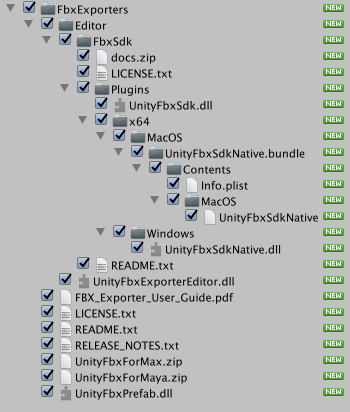

## Known Issues

* When installing a new version of the FBX Exporter Package after using version 1.1.0.b1, the link between Assets and FbxPrefab components may be lost. See [Updating from 1.1.0b1](#Repairs_1_1_0b_1) for repairing instructions.


# Installing the FBX Exporter package in Unity

Before you install the FBX Exporter Package, follow these steps (recommended):

1. Back up your Project.

2. Restart Unity.

3. Delete the *FbxExporters* folder.

4. Select __Assets__ > __Import Package__ > __Custom Package__ in Unity.

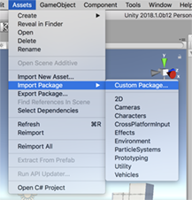

5. Select the FbxExporter package from the file browser and click __Open__ to [import and install](https://docs.unity3d.com/Manual/AssetPackages.html) the new version of the FBX Exporter package.


<a name="Repairs_1_1_0b_1"></a>
## Updating from 1.1.0b1

If your previous version of the FBX Exporter Package was 1.1.0b1, some Assets in your Project may lose their FbxPrefab components. To repair this issue, follow these steps: 

1. If your Project Assets are serialized as Binary, select __Edit__ > __Project Settings__ > __Editor__ to view the Editor Settings. 

2. Change the __Asset Serialization__ mode to __Force Text__. The __Force Text__ option converts all Project Assets to text.

3. Before continuing, back up your Project.

4. Select __Edit__ > __Project Settings__ > __Fbx Export__ to view the [Fbx Export Settings](#FBXSettings).

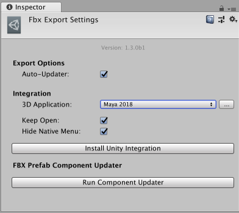

5. Click the __Run Component Updater__ button to repair all text serialized Prefab and Scene Assets in the Project containing the FbxPrefab component.


<a name="ExportFBX"></a>
# Exporting FBX files from Unity

Use __Export To FBX__ (menu: __GameObject__ > __Export To FBX__) to manually export GameObject hierarchies to an FBX file. The FBX Exporter exports selected objects and their descendants to a single FBX file. However, if you select both a parent and a descendant, only the parent’s hierarchy is exported.

The FBX Exporter exports the following objects:

* GameObject hierarchies and their transforms
* Meshes. The FBX Exporter exports multiple copies of the same mesh as instances. The FBX Exporter also exports the following mesh attributes:
    * Normals
    * Binormals
    * Tangents
    * Vertex Colors
    * All 4 Mesh UVs, if present
    * Quads or Triangles
* SkinnedMeshRenderers with the following exceptions:
    * Humanoid rigs are not supported
    * Animated meshes in bone hierarchy are not supported
* Materials as Phong if the material has specular; Lambert in all other cases
* Textures
* Cameras as film cameras with 35mm TV Projection; also the following camera attributes:
    * Projection type (perspective/orthographic)
    * Aperture Width and Height (Height set to 0.612 inches, and width calculated based on aspect ratio)
    * Aspect ratio
    * Focal length
    * Field of view
    * Near and far clipping plane
* Lights of type *Directional*, *Spot* , *Point*, and *Area*; also the following light attributes:
    * Spot Angle (for Spot lights)
    * Color
    * Intensity
    * Range
    * Shadows (either On or Off)
* Legacy and Generic Animation from Animation and Animator components, or from a Timeline clip; also the following animated attributes:
    * Transforms
    * Lights:
        * Intensity
        * Spot Angle (for Spot lights)
        * Color
    * Cameras:
        * Field of View
* Blendshapes


## Export Options window

When exporting an FBX file, the following Export Options window opens, displaying options for specifying what gets exported.

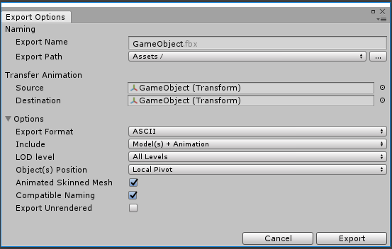


### Export Options Properties

| Property:| Function: |
|:---|:---| 
|__Export Name__ |Specify the filename to export to. |
|__Export Path__ |Specify the location where the FBX Exporter will save the FBX file. |
|__Source__ |Transfer the transform animation from this transform to the Destination. <br/><br/>**Notes:** - __Source__ must be an ancestor of __Destination__<br/> - __Source__ may be an ancestor of the selected object. |
|__Destination__ |Where to transfer the transform animation to (which Transform object).<br/><br/>This object receives the transform animation on objects between __Source__ and __Destination__ as well as the animation on the Source itself.  |
|__Export Format__ |Select the format for the FBX Exporter to use when exporting the FBX file (ASCII or binary). |
|__Include__ |Choose whether to export both Models and Animation, only Models, or only Animations. |
|__LOD level__ |For level of detail (LOD) groups, choose the desired level of detail to export (all, highest, or lowest). <br/><br/>**Notes:** - The FBX Exporter ignores LODs outside of selected hierarchy.<br/> - The FBX Exporter does not filter out objects that are used as LODs and doesn't export them if they aren’t direct descendants of their respective LOD Group |
|__Object(s) Position__ |Choose whether to reset the exported objects to world center, or keep world transforms during export.<br/><br/>If you select multiple objects for export, and you choose __Local Centered__ from this drop-down menu, the FBX Exporter centers objects around a shared root while keeping their relative placement unchanged. |
|__Animated Skinned Mesh__ |Check this option to export animation on objects with skinned meshes.<br/><br/>If unchecked, the FBX Exporter does not export animation on skinned meshes. |
|__Compatible Naming__ |Check this option to control renaming the GameObject and Materials during export. <br/><br/>The FBX Exporter ensures compatible naming with Maya to avoid unexpected name changes between Unity and Maya. During export the FBX Exporter replaces characters in Unity names as follows:<br/> - Replaces invalid characters with underscores ("_"). Invalid characters are all non-alphanumeric characters, except for the colon (":").<br/> - Adds an underscore ("_") to names that begin with a number.<br/> - Replaces diacritics. For example, replaces "é" with “e”.<br/><br/>For FBX Model filenames, the FBX Exporter ensures that names do not contain invalid characters for the file system. The set of invalid characters may differ between file systems.<br/><br/>**Note:** If you have a Material with a space in its name, the space is replaced with an underscore ("_"). This results in a new Material being created when it is imported. For example, the Material named "Default Material" is exported as "Default_Material" and is created as a new Material when it is imported. If you want the exported Material to match an existing Material in the scene, you must manually rename the Material before exporting. |
|__Export Unrendered__ |Check this option to export meshes that either don't have a renderer component, or that have a disabled renderer component. For example, a simplified mesh used as a Mesh collider. |


## Exporting Animation from the Timeline

In order to export an animation clip from the timeline, in the Timeline editor select the desired clip, then from the top menu select __GameObject__ > __Export Selected Timeline Clip__.


## Exporting with relevant system units

The FBX Exporter exports in centimeter units (cm) with the Mesh set to real world meter (m) scale. For example, if vertex[0] is at [1, 1, 1] m., it is converted to [100, 100, 100] cm. 

In 3ds Max, it is recommended to set the system units to centimeters to avoid any scaling on Model import and export.

There are no specific import options to adjust between Unity and Maya. When working in Maya, you can set the working units to meters if you prefer. 

For example, when working with large models in Maya, to ensure that the models clip to meters, adjust the scale of the near and far clipping planes for all cameras by 100x. In addition, you should scale lights by 100x so that objects display in the viewport.

## Known Issues

* Bind pose of animated skinned mesh is lost on export. For example, if you export an animated skinned mesh from Unity and import it into Maya you will not be able to set the character into the bind pose using the Rigging > Skin > Go to Bind Pose command.

* Animated skinned meshes may not export with the correct skinning if they are not in the bind pose on export (that is, not being previewed in the Animation or Timeline windows, and the original Rig's FBX must not contain animation)

* For skinned meshes all bones must be descendants of the root bone. For example, if the root bone is "hips" and the right leg for the same skinned mesh is not a descendant of hips, export will fail.


<a name="LinkedPrefab"></a>
# Converting GameObjects to Linked Prefabs

A Linked Prefab is a Prefab which maintains a link to an FBX file and is responsible for updating the Prefab so that it remains in sync with its source. What it adds to the default Unity behaviour is that the Linked Prefab integrates changes in the hierarchy and transforms (in addition to Meshes and Materials). 

During an update, the Linked Prefab preserves components and object references to the greatest extent possible. If you delete a node in the FBX, the Linked Prefab deletes the corresponding object in Unity along with its components.

The Linked Prefab contains a FbxPrefab script component that is responsible for recording changes and merging FBX Model changes into the Linked Prefab. The automatic update happens whenever the Asset database reimports the corresponding FBX Model, after all Assets have been imported.

Use __Convert To Linked Prefab Instance__ (right-click on an object in the hierarchy view, or menu: __GameObject__ > __Convert To Linked Prefab Instance__) to replace the GameObject hierarchy with an instance of a Prefab that is linked to an FBX Model. 

__Convert To Linked Prefab Instance__ exports each selected GameObject hierarchy and writes both a .prefab and a .fbx file. Linked Prefabs use the same rules as for exporting: all selected objects and their descendants are exported to a single FBX file. If you select both a parent and a descendant, the Linked Prefab only exports the parent’s hierarchy.


<a name="ConvertOptions"></a>
## Convert Options window

When converting to a Linked Prefab, the following window opens, displaying options to specify what gets exported:

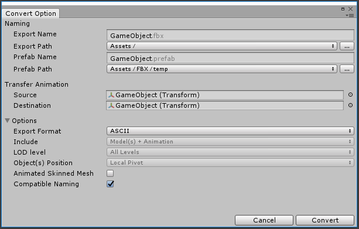


### Convert Option Properties

| Property:| Function: |
|:---|:---| 
|__Export Name__ |Specify the filename to export to |
|__Export Path__ |Specify the location where the FBX Exporter will save the FBX file. |
|__Prefab Name__ |Specify the filename to save the Linked Prefab to |
|__Prefab Path__ |Specify the location where the FBX Exporter will save the linked prefab file. |
|__Source__ |Transfer the transform animation from this transform to __Destination__.<br/><br/>**Notes:** - __Source__ must be an ancestor of __Destination__.<br/> - __Source__ may be an ancestor of the selected object. |
|__Destination__ |Where to copy the transform animation to (which Transform object).<br/><br/>This object receives the transform animation on objects between Source and Destination as well as the animation on the Source itself. |
|__Export Format__ |Select the format for the FBX Exporter to use when exporting the FBX file (ASCII or binary). |
|__Include__ |__Convert to Linked Prefab Instance__ always exports both Models and Animation in the hierarchy. |
|__LOD level__ |__Convert to Linked Prefab Instance__ always exports All levels of detail (LOD) available in the hierarchy for LOD groups. |
|__Object(s) Position__ |__Convert to Linked Prefab Instance__ always resets the root object's transform during export. However, the Prefab maintains the global transform for the root object. |
|__Animated Skinned Mesh__ |Check this option to export animation on objects with skinned meshes.<br/><br/>If unchecked, the FBX Exporter does not export animation on skinned meshes. |
|__Compatible Naming__ |Check this option to control renaming the GameObject and Materials during export. <br/><br/>The FBX Exporter ensures compatible naming with Maya to avoid unexpected name changes between Unity and Maya. During export the FBX Exporter replaces characters in Unity names as follows:<br/> - Replaces invalid characters with underscores ("_"). Invalid characters are all non-alphanumeric characters, except for colon (":").<br/> - Adds an underscore ("_") to names that begin with a number. - Replaces diacritics. For example, replaces "é" with “e”.<br/><br/>For FBX Model filenames, the FBX Exporter ensures that names do not contain invalid characters for the file system. The set of invalid characters may differ between file systems.<br/><br/>**Note:** If you have a Material with a space in its name, the space is replaced with an underscore ("_"). This results in a new Material being created when it is imported. For example, the Material named "Default Material" is exported as "Default_Material" and is created as a new Material when it is imported. If you want the exported Material to match an existing Material in the scene, you must manually rename the Material before exporting. |


## Automatic updates

When you enable the __Auto-Updater__ option in the [Fbx Export Settings](#FBXSettings), the Linked Prefab automatically updates whenever the linked FBX file is reimported. If you disable this option, the Linked Prefab reverts back to the default behavior of only reflecting Material attribute and Mesh changes.

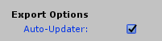

Whenever an FBX file changes on disk and the FBX file resides within the Asset folder of the Unity Project, the built-in FBX Importer runs and updates the geometry. A Linked Prefab merges the following additional changes:

* Adding or removing objects in the hierarchy
* Changing the parent of objects in the hierarchy
* Adding or removing the Mesh component for an object
* Changing the transform of the children in the hierarchy
* Adding or removing a Camera component for an object
* Changing the Camera component’s properties

**Notes:** 

* If a merge conflict occurs between a changed FBX file and a Linked Prefab, the FBX file takes precedence.
* If the updater detects that an FBX node has been deleted or renamed since the last update, by default it deletes the corresponding object in the Prefab as well, along with its components. See [Name Remapping between FBX and Prefabs](#Remapping) for strategies for how to manage this more carefully.


<a name="Remapping"></a>
## Name Remapping between FBX and Prefabs

You can use the __Name Remapping__ feature in the FBX Exporter tool to apply name changes to nodes in Unity's [Linked Prefab](#LinkedPrefab) by remapping them to use the names from your 3D modeling software. For example, during level design you might use names that are less formal in Unity. When you are in production mode, you might have to change the names to match the more formal names coming from Maya or 3ds Max.

In order to access the Name Remapping feature, first disable the Auto-Updater. When you disable the __Auto-Updater__ option in the [Fbx Export Settings](#FBXSettings), no automatic updates to the Prefab occur when you re-import the Linked FBX.

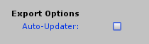

In order to update the Prefab, select the Prefab instance in the Scene and select __GameObject__ > __Update from FBX__. 

In the case of a name change, the following window opens, allowing you to determine the outcome of the update.

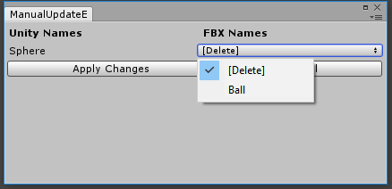

Click __Apply Changes__ to make the changes, or __Cancel__ to cancel the update.

If you re-enable the __Auto-Updater__ option after having disabled manual updates, you need to manually run __Update from FBX__ on each Prefab to ensure that all pending updates have been processed. If the FBX changes, the automatic update is applied with the last name remapping settings.

**Notes:** 

* It is very important to disable the Auto-Updater option in the FBX Settings window before starting this process. 
* The Name Remapping ignores the root object, since the name comes from the name of the FBX file, rather than what's in the file.


## Known Issues

* Name or path changes are ignored when converting a Model instance.


<a name="Integration"></a>
# Integrating Unity with 3D modeling software

The Unity Integration tool allows you to effortlessly exchange Assets between Unity and either __Maya__, __Maya LT__ or __3ds Max__. 

Use the Unity Integration tool to import and export FBX files directly to and from Unity without having to specify filenames, select objects, or set FBX importer or exporter settings.

To customize the FBX Importer or Exporter settings in Maya or Maya LT, use the *unityFbxImportSettings.mel* and *unityFbxExportSettings.mel* files. Both files are located in the *Integrations/Autodesk/maya/scripts* folder. 

For 3ds Max, use the *unityFbxImportSettings.ms* and *unityFbxExportSettings.ms* files located in the *Integrations/Autodesk/max/scripts* folder.

## Installing an Integration

To install Unity Integration for Maya, Maya LT, or 3ds Max, open [Fbx Export Settings](#FBXSettings) (menu: __Edit__ > __Project Settings__ > __Fbx Export__) in Unity:


Use the __3D Application__ property to choose the 3D modeling software and version where you want to install the Unity Integration. 

To select a version of Maya, Maya LT, or 3ds Max installed outside the default location, click the Browse button.

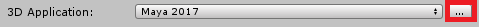

Before installing Unity Integration, close all instances of the selected 3D modeling software that matches the specified version.

Click __Install Unity Integration__ to install the Unity Integration for the selected 3D modeling software. Unity Integration comes packaged in several zip files (one zip file per supported application). Then select a target folder to extract the Unity Integration to when prompted. The target folder can be outside of your current Project. Maya and Maya LT both use the same zip folder.

The application starts, configures the plug-in, and automatically exits. Unity reports whether the installation was a success.

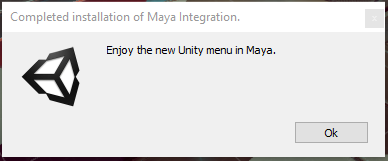

If an error occurs during startup, Maya may not close. If this happens, check the Maya console to see if you can resolve the issue, and then manually close Maya.

If you enabled the __Keep Open__ option in the [Fbx Export Settings](#FBXSettings) window, then Maya stays open after installation completes.


## Manually Installing a Maya Integration

Sometimes you need to install a Maya integration manually. For example, if you are using an unsupported version of Maya.

To manually install a Maya Integration, follow these steps:

1. Extract the *UnityFbxForMaya.zip* file in the *FbxExporters/* folder from the Unity package to a writable location. This can be in or outside of your Unity Project.

2. Copy the contents of *Integrations/Autodesk/maya/UnityFbxForMaya.txt* from the unzipped folder to the following file:

* On Windows:<br/>*C:\Users\{username}\Documents\maya\modules\UnityFbxForMaya.mod*
* On Mac:<br/>*$HOME/Library/Preferences/Autodesk/Maya/modules/UnityFbxForMaya.mod*

3. In *UnityFbxForMaya.mod*, modify the following line (mel code):
```
+ UnityFbxForMaya {Version} {UnityIntegrationsPath}/Integrations/Autodesk/maya
```

... where `{Version}` = `1.3.0b1` (or your version number of the FBX Exporter package) and `{UnityIntegrationsPath}` = the location where you unzipped UnityFbxForMaya.zip in step 1


4. Locate the following file (if it doesn't exist, create the file):

* On Windows: <br/>*C:\Users\{username}\Documents\maya\scripts\userSetup.mel*
* On Mac: <br/>*$HOME/Library/Preferences/Autodesk/Maya/scripts/userSetup.mel*

5. Add this line (mel code):
```
if(`exists unitySetupUI`){ unitySetupUI; }
```

6. Open Maya, and then open the Script Editor:

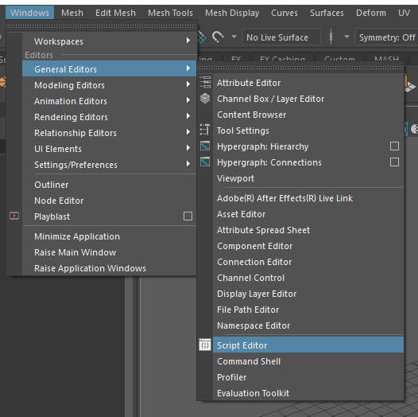 

7. Run the following (mel code):
```
unityConfigure "{UnityProjectPath}" "{ExportSettingsPath}" "{ImportSettingsPath}" 0 0;
```

... where `{UnityProjectPath}` = path/to/UnityProject and `{ExportSettingsPath}` = path/to/Integrations/Autodesk/maya/scripts/unityFbxExportSettings.mel and `{ImportSettingsPath}` = path/to/Integrations/Autodesk/maya/scripts/unityFbxImportSettings.mel


## Working with Maya 2017+ and Maya LT 2017+

### Importing from Unity

Importing an FBX Model automatically configures the plug-in for export. The plug-in remembers your Unity Project, the export filenames, and which objects to export per file.

Select __File__ > __Unity__ > __Import__ to open a file browser directly in your current Unity Project. 

Use the file browser to select the FBX files to import. One or more files can be selected at once. Hold Shift or Ctrl to select multiple files.

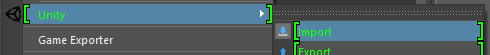

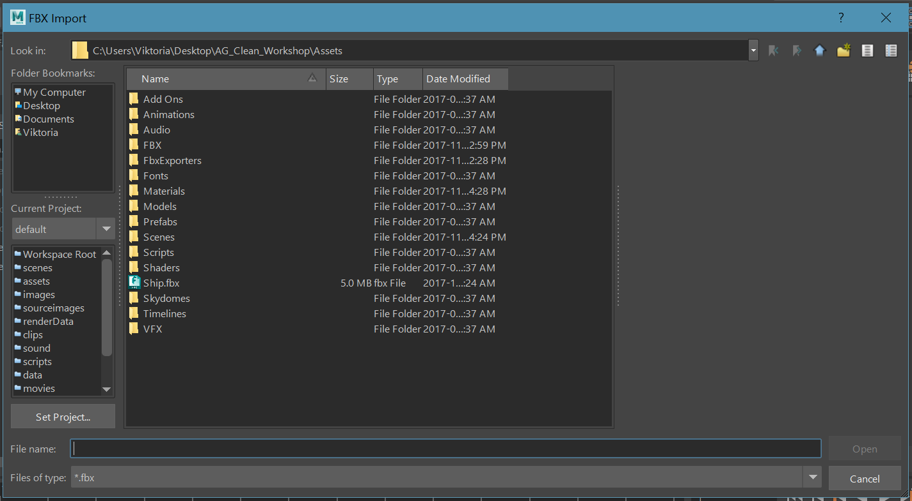

The FBX Exporter adds the contents of each imported file to an export set named after the imported FBX file. For example, if you import *model.fbx*, you can find its contents in an export set called *model_UnityExportSet*.

In addition, the contents of the file are placed into a namespace based on the filename. For *model.fbx*, the contents are placed into the `model:` namespace.

Animation files using the **@** notation (*<modelname>@<animation>.fbx*), are recognized as animation files belonging to the Model contained in *model.fbx*.

For instance, if you import a file called *model@anim.fbx*, the export set and namespace name are based on the name before the **@** symbol. Therefore, it uses the same set and namespace as *model.fbx*. 

This allows animation files to be easily imported and applied to the appropriate objects in the Scene. Maya stores the animation filename and path for easy export. A single animation file is supported per model file. Importing a new animation overwrites the existing animation in the Scene.


### Exporting to Unity

There are three options available for export in Maya and Maya LT: 

* Export
* Export Model Only
* Export Animation Only

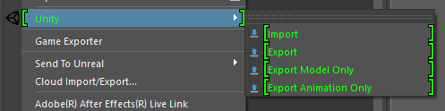

__File__ > __Unity__ > __Export __exports both Models and animation contained in the export sets selected for export.

__File__ > __Unity__ > __Export Model Only__ exports all Models in the selected export sets, but does not export any animation.

__File__ > __Unity__ > __Export Animation Only__ exports only the animation applied to the objects in the export set as well as the minimum components required for the animation (such as transforms, animated lights and cameras).

**Note:** If no animation file with the **@** notation has been imported, then this option has no effect. The workaround for exporting a new animation is to first import an empty FBX file with the **@** notation (*{model}@anim.fbx*), so that the export set is configured correctly.

In order to export objects from the desired export set, you can select one or more objects in the set or the set itself. In either case, the FBX Exporter exports the entire contents of the set.

If you select multiple sets or objects from multiple sets, then the FBX Exporter exports each set to its respective file defined in the attributes of the set.


## Working with 3ds Max 2017+

### Importing from Unity

Importing an FBX Model automatically configures the plug-in for export. The plug-in remembers your Unity Project, the export filename, and which objects to export.

Select __Import__ to open a file browser directly in your current Unity Project:

* In 3ds Max 2018, select __File__ > __Import__ > __Import from Unity__.

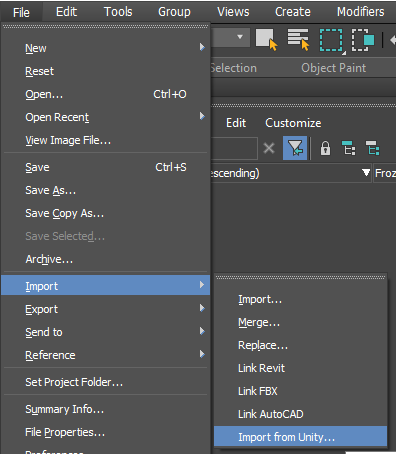

* In 3ds Max 2017, select __Unity__ > __Import__.

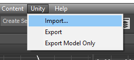

Use the file browser to select one or more Model(s) to import. You can hold the Shift or Ctrl keys to select multiple files.

The FBX Exporter automatically adds the contents of each imported file to a selection set named after the imported FBX file. For example, if you import *model.fbx*, you can find its contents in a selection set called *model_UnityExportSet*.

A dummy with the same name (*model_UnityExportSet*) is also created for each imported file and parented under another dummy object called *UnityFbxExportSets*.

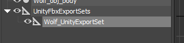

This dummy contains the imported file’s path and filename as custom attributes, which the FBX Exporter also uses on export.

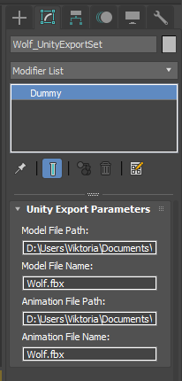

The **@** notation (*<modelname>@<animation>.fbx*), indicates that this is an animation file belonging to the Model contained in *model.fbx*.

For instance, if you import a file called *model@anim.fbx*, the export set is based on the name before the **@** symbol. Therefore, it uses the same set as *model.fbx*. 

This allows you to easily import animation files and apply them to the appropriate objects in the Scene. A single animation file is supported per Model file. Importing a new animation overwrites the existing animation in the Scene.

**Note:** Exporting animation only from 3ds Max is not supported.

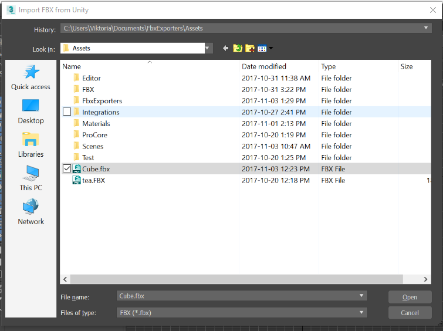

If the system units are not set to centimeters, 3ds Max prompts you to change the system units to centimeters. Select one of the following options:

* Click __Yes__ to change the system units (recommended) to centimeters, ensuring that the scaling is maintained on export. 
* Click __No__ to use the current system units (not recommended). The prompt does not appear again for the remainder of the 3ds Max session or, in the case of a .max file, does not appear again for this file.

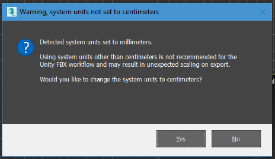


### Export to Unity

There are two options available for export in 3ds Max: 

* Export
* Export Model Only

__Export __exports both Models and animation contained in the export sets selected for export.

__Export Model Only__ exports all Models in the selected export sets, but does not export any animation.

Select either to automatically export with the settings and Models configured during import. No additional steps are required.

In 3ds Max 2018, select __File__ > __Export__ > __Export to Unity__ or __File__ > __Export__ > __Export to Unity (Model Only)__.

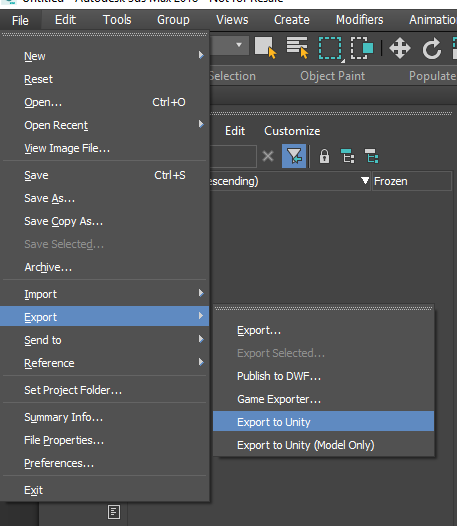

In 3ds Max 2017, select __Unity__ > __Export__ or __Unity__ > __Export Model Only__.

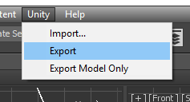

In order to export objects from the desired export set, you can select one or more objects in the set, the set itself, or the corresponding dummy object. In either case, the FBX Exporter exports the entire contents of the set.

If you select multiple dummy objects corresponding to sets or objects from multiple sets, then the FBX Exporter exports each set to its respective file defined in the custom attributes of the set’s dummy object.

In each case, selecting __Export__ automatically exports the current Model back to Unity. When you switch back into Unity, your Scene has already been updated.

Unity export uses the selection sets created on import to determine which objects to export. If you add a new object to the Model, you must also add this new object to the model’s UnityExportSet set.

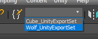

Click the __Edit Named Selection Sets__ button to edit a UnityExportSet. 

To add an object to a set, select the set, select an object and click the __Add Selected Objects__ button. 

To remove an object from a set, select the object in the set and click the __Subtract Selected Objects__ button. 

**Tip:** You can also right-click the UnityExportSets and add or remove objects using the context menu.


# Setting FBX Export options

Use the Fbx Export Settings window to specify whether or not to automatically update [Linked Prefabs](#LinkedPrefab) and to install the [Unity Integration](#Integration) for Maya, Maya LT, or 3ds Max.


<a name="FBXSettings"></a>
## Fbx Export Settings window

| Property:| Function: |
|:---|:---| 
|__Auto-Updater__ |Check this option to enable automatic updating for Linked Prefabs whenever their linked FBX files is updated. |
|__3D Application__ |Select the 3D modeling software you want to integrate with Unity. Maya 2017+, Maya LT 2017+, and 3ds Max 2017+ are the three applications currently supported.<br/><br/>Click the Browse button to choose a 3D modeling software installed in a non-standard location.  |
|__Keep Open__ |Check this option to keep the selected 3D modeling software open after installing it. |
|__Hide Native Menu__ |Check this option to hide the native __Send to Unity__ menu in Maya and Maya LT. |
|__Install Unity Integration__ |Click this button to install [Unity Integration](#Integration) for the selected __3D Application__. |
|__Run Component Updater__ |Click this button to run the [Component Updater](#Repairs_1_1_0b_1) to repair any broken FbxPrefab components if your previous version of the FBX Exporter Package was 1.1.0b1. |


# Developer’s Guide

As a developer you have access to the FBX Exporter from C# scripting. You can use the basic API by providing a single GameObject, or a list of GameObjects. Note that default export settings are used for exporting the GameObjects to the FBX file.

You can call the FBX Exporter from C# using methods found in the "UnityEditor.Formats.Fbx.Exporter" namespace, for example:

```
using System.IO;
using UnityEngine;
using UnityEditor;
using UnityEditor.Formats.Fbx.Exporter

public static void ExportGameObjects(Object[] objects)
{
    string filePath = Path.Combine(Application.dataPath, "MyGame.fbx");
    ModelExporter.ExportObjects(filePath, objects);
    
    // ModelExporter.ExportObject can be used instead of 
    // ModelExporter.ExportObjects to export a single game object (and its children)
}
```
