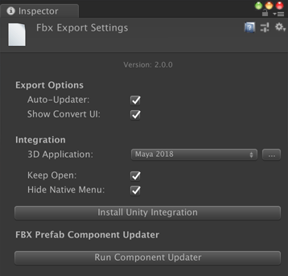
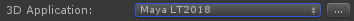
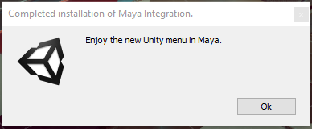
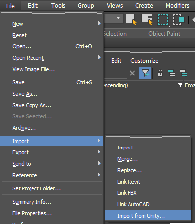
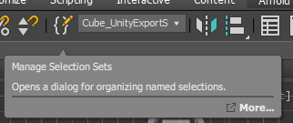

# Integrating Unity with 3D modeling software

The Unity Integration tool allows you to effortlessly exchange Assets between Unity and either **Autodesk® Maya®**, **Autodesk® Maya LT™** or __Autodesk® 3ds Max®__. 

Use the Unity Integration tool to import and export FBX files directly to and from Unity without having to specify filenames, select objects, or set FBX importer or exporter settings.

To customize the FBX Importer or Exporter settings in Autodesk® Maya® or Autodesk® Maya LT™, use the *unityFbxImportSettings.mel* and *unityFbxExportSettings.mel* files. Both files are located in the *Integrations/Autodesk/maya/scripts* folder. 

For Autodesk® 3ds Max®, use the *unityFbxImportSettings.ms* and *unityFbxExportSettings.ms* files located in the *Integrations/Autodesk/max/scripts* folder.

## Installing an Integration

To install Unity Integration for Autodesk® Maya®, Autodesk® Maya LT™, or Autodesk® 3ds Max®, open [Fbx Export Settings](options.html) (menu: __Edit__ > __Project Settings__ > __Fbx Export__) in Unity:



Use the __3D Application__ property to choose the 3D modeling software and version where you want to install the Unity Integration. 

To select a version of Autodesk® Maya®, Autodesk® Maya LT™, or Autodesk® 3ds Max® installed outside the default location, click the Browse button.



Before installing Unity Integration, close all instances of the selected 3D modeling software that matches the specified version.

Click __Install Unity Integration__ to install the Unity Integration for the selected 3D modeling software. 


If you already unpacked a previous integration in the selected folder, Unity prompts you to either use the existing integration or to overwrite it with the newer version.

Unity Integration comes packaged in several zip files (one zip file per supported application). When prompted, select a target folder where you want to extract the Unity Integration. The target folder can be outside of your current Project. Autodesk® Maya® and Autodesk® Maya LT™ both use the same zip folder.

The application starts, configures the plug-in, and automatically exits. Unity reports whether the installation was a success.



If an error occurs during startup, Autodesk® Maya® or Autodesk® Maya LT™ may not close. If this happens, check the Autodesk® Maya® or Autodesk® Maya LT™ console to see if you can resolve the issue, and then manually close Autodesk® Maya® or Autodesk® Maya LT™.

If you enabled the __Keep Open__ option in the [Fbx Export Settings](options.html) window, then Autodesk® Maya® or Autodesk® Maya LT™ stays open after installation completes.


## Manually Installing an Autodesk® Maya® or Autodesk® Maya LT™ Integration

In some cases, you have to install your integration manually. For example, you may be using an unsupported version of Autodesk® Maya® or Autodesk® Maya LT™.

To manually install an Autodesk® Maya® or Autodesk® Maya LT™ Integration, follow these steps:

1. Locate the *UnityFbxForMaya.zip* file. You can find it in Unity's Project view, under the *Packages/FBX Exporter/Editor/Integrations* folder.

2. Extract the archive to a folder where you have write permission. This can be in or outside of your Unity Project.

3. Copy the contents of *Integrations/Autodesk/maya/UnityFbxForMaya.txt* from the unzipped folder to the following file:

  * On Windows:<br/>*C:\Users\\{username}\Documents\maya\modules\UnityFbxForMaya.mod*
  * On Mac:<br/>*$HOME/Library/Preferences/Autodesk/Maya/modules/UnityFbxForMaya.mod*

4. In *UnityFbxForMaya.mod*, modify the following line (mel code): <br/>
  ```UnityFbxForMaya {Version} {UnityIntegrationsPath}/Integrations/Autodesk/maya```

  Set `{Version}` = `2.0.0` (or your version number of the FBX Exporter package) and `{UnityIntegrationsPath}` = the location where you unzipped *UnityFbxForMaya.zip* in step 1.

5. Locate the following file (if it doesn't exist, create the file):

  * On Windows: <br/>*C:\Users\{username}\Documents\maya\scripts\userSetup.mel*
  * On Mac: <br/>*$HOME/Library/Preferences/Autodesk/Maya/scripts/userSetup.mel*

6. Add this line (mel code):
  ```if(`exists unitySetupUI`){ unitySetupUI; }```

7. Open Autodesk® Maya® or Autodesk® Maya LT™, and then open the Script Editor:

   

8. Run the following (mel code): <br/>
  ```unityConfigure "{UnityProjectPath}" "{ExportSettingsPath}" "{ImportSettingsPath}" 0 0;```

  Where you replace `{UnityProjectPath}` with the path to your Unity Project, and  `{ExportSettingsPath}` with the path to *Integrations/Autodesk/maya/scripts/unityFbxExportSettings.mel* and `{ImportSettingsPath}` with the path to *Integrations/Autodesk/maya/scripts/unityFbxImportSettings.mel*.


## Working with Autodesk® Maya® 2017+ and Autodesk® Maya LT™ 2017+

### Importing from Unity

Importing an FBX Model automatically configures the plug-in for export. The plug-in remembers your Unity Project, the export filenames for your Models and animations, and which objects to export per file.

Select __File__ > __Unity__ > __Import__ to open a file browser directly in your current Unity Project. 

Use the file browser to select the FBX files to import. One or more files can be selected at once. Hold Shift or Ctrl to select multiple files.


The FBX Exporter adds the contents of each imported file to an export set named after the imported FBX file. For example, if you import *model.fbx*, you can find its contents in an export set called *model_UnityExportSet*.

In addition, the contents of the file are placed into a namespace based on the filename. For *model.fbx*, the contents are placed into the `model:` namespace.

Animation files using the **@** notation (**modelname**@**animation**.fbx), are recognized as animation files belonging to the Model contained in *model.fbx*.

For instance, if you import a file called *model@anim.fbx*, the export set and namespace name are based on the name before the **@** symbol. Therefore, it uses the same set and namespace as *model.fbx*. 

This allows animation files to be easily imported and applied to the appropriate objects in the Scene. Autodesk® Maya® and Autodesk® Maya LT™ store the animation filename and path for easy export. A single animation file is supported per model file. Importing a new animation overwrites the existing animation in the Scene.


### Exporting to Unity

There are three options available for export in Autodesk® Maya® and Autodesk® Maya LT™: 

* Export
* Export Model Only
* Export Animation Only


__File__ > __Unity__ > __Export__ exports both Models and animation contained in the export sets selected for export.

__File__ > __Unity__ > __Export Model Only__ exports all Models in the selected export sets, but does not export any animation.

__File__ > __Unity__ > __Export Animation Only__ exports only the animation applied to the objects in the export set as well as the minimum components required for the animation (such as transforms, animated lights and cameras).

> ***Note:*** If no animation file with the **@** notation has been imported, then this option has no effect. The workaround for exporting a new animation is to first import an empty FBX file with the **@** notation (*{model}@anim.fbx*), so that the export set is configured correctly.

In order to export objects from the desired export set, you can select one or more objects in the set or the set itself. In either case, the FBX Exporter exports the entire contents of the set.

If you select multiple sets or objects from multiple sets, then the FBX Exporter exports each set to its respective file defined in the attributes of the set.


## Working with Autodesk® 3ds Max® 2017+

### Importing from Unity

Importing an FBX Model automatically configures the plug-in for export. The plug-in remembers your Unity Project, the export filename, and which objects to export.

Select __Import__ to open a file browser directly in your current Unity Project:

* In Autodesk® 3ds Max® 2018, select __File__ > __Import__ > __Import from Unity__.



* In Autodesk® 3ds Max® 2017, select __Unity__ > __Import__.


Use the file browser to select one or more Model(s) to import. You can hold the Shift or Ctrl keys to select multiple files.

The FBX Exporter automatically adds the contents of each imported file to a selection set named after the imported FBX file. For example, if you import *model.fbx*, you can find its contents in a selection set called *model_UnityExportSet*.

A dummy with the same name (*model_UnityExportSet*) is also created for each imported file and parented under another dummy object called *UnityFbxExportSets*.


This dummy contains the imported file’s path and filename as custom attributes, which the FBX Exporter also uses on export.


The **@** notation (**modelname**@**animation**.fbx), indicates that this is an animation file belonging to the Model contained in *model.fbx*.

For instance, if you import a file called *model@anim.fbx*, the export set is based on the name before the **@** symbol. Therefore, it uses the same set as *model.fbx*. 

This allows you to easily import animation files and apply them to the appropriate objects in the Scene. A single animation file is supported per Model file. Importing a new animation overwrites the existing animation in the Scene.

**Note:** Exporting animation only from Autodesk® 3ds Max® is not supported.


If the system units are not set to centimeters, Autodesk® 3ds Max® prompts you to change the system units to centimeters. Select one of the following options:

* Click __Yes__ to change the system units (recommended) to centimeters, ensuring that the scaling is maintained on export. 
* Click __No__ to use the current system units (not recommended). The prompt does not appear again for the remainder of the Autodesk® 3ds Max® session or, in the case of a .max file, does not appear again for this file.


### Export to Unity

There are two options available for export in Autodesk® 3ds Max®: 

* Export
* Export Model Only

__Export__ exports both Models and animation contained in the export sets selected for export.

__Export Model Only__ exports all Models in the selected export sets, but does not export any animation.

Select either to automatically export with the settings and Models configured during import. No additional steps are required.

In Autodesk® 3ds Max® 2018, select __File__ > __Export__ > __Export to Unity__ or __File__ > __Export__ > __Export to Unity (Model Only)__.


In Autodesk® 3ds Max® 2017, select __Unity__ > __Export__ or __Unity__ > __Export Model Only__.


In order to export objects from the desired export set, you can select one or more objects in the set, the set itself, or the corresponding dummy object. In either case, the FBX Exporter exports the entire contents of the set.

If you select multiple dummy objects corresponding to sets or objects from multiple sets, then the FBX Exporter exports each set to its respective file defined in the custom attributes of the set’s dummy object.

In each case, selecting __Export__ automatically exports the current Model back to Unity. When you switch back into Unity, your Scene has already been updated.

Unity export uses the selection sets created on import to determine which objects to export. If you add a new object to the Model, you must also add this new object to the Model’s *UnityExportSet* set.


Click the __Manage Selection Sets__ button to edit a *UnityExportSet* set. 



To add an object to a set, select the set, select an object and click the __Add Selected Objects__ button. 

To remove an object from a set, select the object in the set and click the __Subtract Selected Objects__ button. 

> ***Tip:*** You can also right-click the UnityExportSets and add or remove objects using the context menu.


In Autodesk® 3ds Max®, use the __Add Selected Objects__ button (red outline) to add objects to the *Wolf_UnityExportSet* set.


