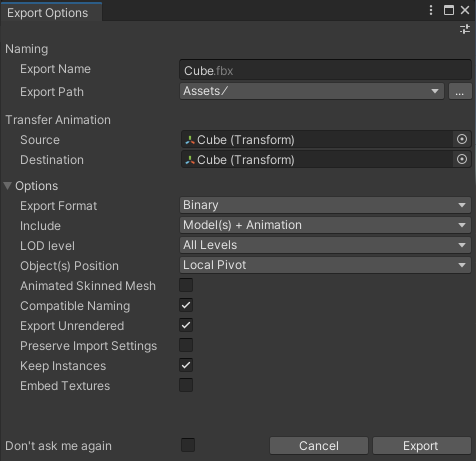

# Export GameObjects to FBX

Export one or multiple GameObjects and their children from the Hierarchy to an FBX file.

1. In the Hierarchy window, select one or multiple GameObjects to export.

2. Right click on any of the selected GameObjects and select **Export To FBX**.

3. Review the [Export Options](ref-export-options.md) according to your FBX export needs.

   

4. Click on **Export**.

The FBX Exporter exports the selected GameObjects and all their children GameObjects to a single FBX file in the folder specified in **Export Path**.

>**Note:**
>* If your selection includes multiple GameObjects that have no hierarchical relationship, the FBX Exporter includes the whole selection in the same exported FBX file.
>* If your selection includes both a parent and one of its children, the FBX Exporter exports the whole as if you had selected the parent only.

## Additional resources

* [FBX Export Options](ref-export-options.md)
* [Exported objects and attributes](exported-attributes.md)
