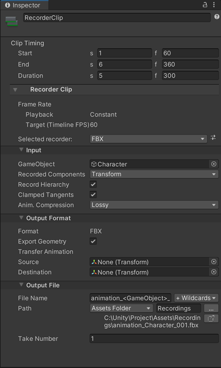

# Record FBX animations via a Timeline Recorder Track

Set up one or multiple Recorder clips in a Timeline Recorder Track to activate the recording of a GameObject's animations to FBX at specific time or frame intervals in Play mode.

>**Note:** This scenario requires to have both the [Recorder](https://docs.unity3d.com/Packages/com.unity.recorder@latest) and [Timeline](https://docs.unity3d.com/Packages/com.unity.timeline@latest) packages installed in addition to the FBX Exporter package.

To record an FBX animation through a Timeline Recorder Track:

1. Open the Timeline where you want to set up the Recorder Track.

2. In the Timeline window, click on the Add (**+**) button and select **UnityEditor.Recorder.Timeline** > **Recorder Track**.

3. Right-click in the **Recorder Track** you just added and select **Add Recorder Clip**.

   

4. Select the added **Recorder Clip**, and in the Inspector, in the **Selected recorder** dropdown list, select **FBX**.

   

6. In the **Input** section, set the **GameObject** to export the animation from.

6. Adjust the clip timing according to the time or frame interval you need to record the FBX animation in.

7. Set up the other [FBX Recorder properties](ref-recorder-properties.md) according to your needs.

8. To start the recording, enter Play mode.

The FBX Recorder clip starts and stops according to the clip timing you've set up in Timeline and the Recorder saves the animation to an FBX file in the folder specified in **Output File** > **Path**.

## Additional resources

* [Recorder package documentation](https://docs.unity3d.com/Packages/com.unity.recorder@latest)
* [Timeline package documentation](https://docs.unity3d.com/Packages/com.unity.timeline@latest)
* [FBX Recorder properties](ref-recorder-properties.md)
* [Exported animation attributes](exported-attributes.md#animation)
