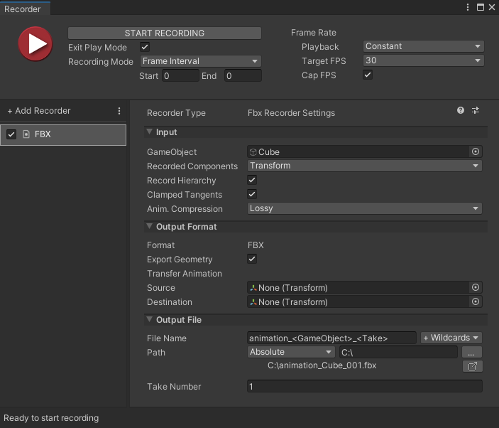

# Record FBX animations via the Recorder window

Use the Recorder window to record a GameObject's animation to FBX within an arbitrary time or frame interval in Play mode.

>**Note:** This scenario requires to have the [Recorder](https://docs.unity3d.com/Packages/com.unity.recorder@latest) package installed in addition to the FBX Exporter package.

To record an FBX animation via the Recorder window:

1. Open the Recorder window: select **Window** > **General** > **Recorder** > **Recorder Window**.

2. In the Recorder window, add a new FBX recorder: select **Add Recorder**, and then select **FBX**.

   

3. In the **Input** section, set the GameObject to export the animation from.

4. Set up the time or frame interval to record and the other [FBX Recorder properties](ref-recorder-properties.md) according to your needs.

5. Select **Start Recording**.

The recording starts and stops according to the interval you've set up in the Recorder window and the Recorder saves the animation to an FBX file in the folder specified in **Output File** > **Path**.

## Additional resources

* [Recorder package documentation](https://docs.unity3d.com/Packages/com.unity.recorder@latest)
* [FBX Recorder properties](ref-recorder-properties.md)
* [Exported animation attributes](exported-attributes.md#animation)
