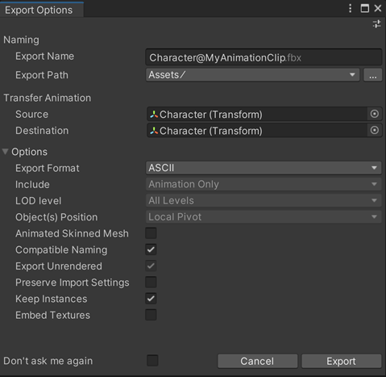

# Export a Timeline animation clip to FBX

Export any Timeline clip containing animation to an FBX file.

>**Note:** This scenario requires to have the [Timeline](https://docs.unity3d.com/Packages/com.unity.timeline@latest) package installed in addition to the FBX Exporter package.

To export an animation clip:

1. In the Timeline window, right-click on the clip to export, and then select **Export Clip To FBX**.

2. Review the [Export Options](ref-export-options.md) according to your FBX export needs.

   

3. Click on **Export**.

The FBX Exporter exports the selected animation clip to an FBX file in the folder specified in **Export Path**.

>**Note:** The FBX Exporter doesn't support multiple clip selection for export.

## Additional resources

* [Timeline package documentation](https://docs.unity3d.com/Packages/com.unity.timeline@latest)
* [FBX Export Options](ref-export-options.md)
* [Exported animation attributes](exported-attributes.md#animation)
