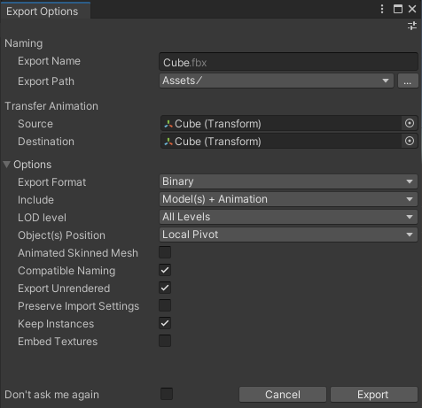

# Exporting FBX files from Unity

Use __Export To FBX__ (menu: __GameObject__ > __Export To FBX__) to manually export GameObject hierarchies to an FBX file. The FBX Exporter exports selected objects and their descendants to a single FBX file. However, if you select both a parent and a descendant, only the parent’s hierarchy is exported.

The FBX Exporter exports the following objects:

* GameObject hierarchies and their transforms
* [Meshes](#meshes) 
* SkinnedMeshRenderers with the following exceptions:
    * Humanoid rigs are not supported
    * Meshes in bone hierarchies are not supported
* Materials as Phong if the material has specular; Lambert in all other cases
* Textures
* [Cameras](#cameras)
* [Lights](#lights)
* [Contraints](#constraints)
* [Animation](#animation)
* Blendshapes

## Mesh support

The FBX Exporter exports multiple copies of the same Mesh as instances. The FBX Exporter also exports the following mesh attributes:

- Normals
- Binormals
- Tangents
- Vertex Colors
- All 8 Mesh UVs, if present
- Quads or Triangles

## Cameras

The FBX Exporter exports both Game Cameras and Physical Cameras.

> **NOTE:** In Unity's Inspector, a Camera's **Physical Camera** property determines whether it is a *Physical Camera* or a *Game Camera*.

### Physical Cameras

The FBX Exporter exports Physical Cameras, including these properties:

- **Focal Length**
- **Lens Shift**

### Game Cameras

On export, the FBX Exporter sets the **Aperture Height** to 0.612 inches, and calculates the **Aperture Width** using this sensor back relative to the Camera's Aspect Ratio. For example:

    * Full 1024 4:3 (1024x768) 
       *  Aspect Ratio 4:3 
       *  Aperture Width = 0.612 * (1024/768)

The Aperture Width and Height values appear in Unity's Inspector as the **Sensor Size** property in millimeters. 

The FBX Exporter derives the **Focal Length** from the vertical Field of View (FOV) and the sensor back settings (Aperture Width and Aperture Height). The FBX Exporter uses the default FBX setting for Aperture Mode: Vertical.

**Film Resolution Gate** is set to Horizontal so that the importing software fits the resolution gate horizontally within the film gate. 

The **Near & Far** Clipping Plane values have a range of 30 cm to 600000 cm.

In addition, the **Projection** type (perspective/orthographic) and **Aspect Ratio** are also exported.

## Lights

The FBX Exporter exports Lights of type *Directional*, *Spot*, *Point*, and *Area*.

It also exports the following Light attributes:

- Spot Angle (for Spot lights)

- Color

- Intensity

- Range

- Shadows (either On or Off)

  

## Constraints

The FBX Exporter exports these types of Constraints:

- [Rotation](#cns_rotation)
- [Aim](#cns_aim)
- [Position](#cns_position)
- [Scale](#cns_scale)
- [Parent](#cns_parent)

In addition, the FBX Exporter also exports the following attributes for all Constraint types:

- Sources
- Source Weight
- Weight
- Active

### Rotation

The FBX Exporter exports the following attributes for the Rotation Constraint type:

- Affected axes (X,Y,Z)
- Rotation Offset
- Rest Rotation

### Aim

The FBX Exporter exports the following attributes for the Rotation Constraint type:

- Affected axes (X,Y,Z)
- Rotation Offset
- Rest Rotation
- World Up Type
- World Up Object
- World Up Vector
- Up Vector
- Aim Vector

### Position

The FBX Exporter exports the following attributes for the Position Constraint type:

- Affected axes (X,Y,Z)
- Translation Offset
- Rest Translation

### Scale

The FBX Exporter exports the following attributes for the Scale Constraint type:

- Affected axes (X,Y,Z)
- Scale Offset
- Rest Scale

### Parent

The FBX Exporter exports the following attributes for the Parent Constraint type:

- Source Translation Offset
- Source Rotation Offset
- Affect Rotation Axes
- Affect Translation Axes
- Rest Translation
- Rest Rotation

## Animation

The FBX Exporter exports Legacy and Generic Animation from Animation and Animator components, or from a Timeline clip. 

In addition, it also exports the following animated attributes:

- Transforms
- Lights:
  - Intensity
  - Spot Angle (for Spot lights)
  - Color
- Cameras:
  - Field of View
- Constraints:
  - Weight
  - Source Weight
  - Translation Offset (Position Constraint)
  - Rotation Offset (Rotation Constraint and Aim Constraint)
  - Scale Offset (Scale Constraint)
  - Source Translation Offset (Parent Constraint)
  - Source Rotation Offset (Parent Constraint)
  - World Up Vector (Aim Constraint)
  - Up Vector (Aim Constraint)
  - Aim Vector (Aim Constraint)

## Export Options window

When exporting an FBX file, the following **Export Options** window opens, displaying options for specifying what gets exported.

### Export Options properties

| Property:                 | Function:                                                    |
| :------------------------ | :----------------------------------------------------------- |
| __Export Name__           | Specify the name of the FBX file to export.                  |
| __Export Path__           | Specify the location where the FBX Exporter will save the FBX file. |
| __Source__                | Transfer the transform animation from this object to the __Destination__ transform.   **NOTES:**  - __Source__ must be an ancestor of __Destination__  - __Source__ may be an ancestor of the selected object. |
| __Destination__           | Which object to transfer the transform animation to.  This object receives the transform animation on objects between __Source__ and __Destination__ as well as the animation on the Source itself. |
| __Export Format__         | Select the format to use in the FBX file (ASCII or Binary).  |
| __Include__               | Choose whether to export both Models and Animation, only Models, or only Animations. |
| __LOD level__             | For level of detail (LOD) groups, choose the desired level of detail to export (all, highest, or lowest).   **NOTES:**  - The FBX Exporter ignores LODs outside of selected hierarchy.  - The FBX Exporter does not filter out objects that are used as LODs and doesn't export them if they aren’t direct descendants of their respective LOD Group |
| __Object(s) Position__    | Choose whether to reset the exported objects to world center, or keep world transforms during export.  If you select multiple objects for export, and you choose __Local Centered__ from this drop-down menu, the FBX Exporter centers objects around a shared root while keeping their relative placement unchanged. |
| __Animated Skinned Mesh__ | Check this option to export animation on objects with skinned meshes.  If unchecked, the FBX Exporter does not export animation on skinned meshes. |
| __Compatible Naming__     | Check this option to control renaming the GameObject and Materials during export.   The FBX Exporter ensures compatible naming with Autodesk® Maya® and Autodesk® Maya LT™ to avoid unexpected name changes between Unity and Autodesk® Maya® and Autodesk® Maya LT™. During export the FBX Exporter replaces characters in Unity names as follows:  - Replaces invalid characters with underscores ("\_"). Invalid characters are all non-alphanumeric characters, except for the colon (":").  - Adds an underscore ("\_") to names that begin with a number.  - Replaces diacritics. For example, replaces "é" with “e”.  **NOTE:** If you have a Material with a space in its name, the space is replaced with an underscore ("_"). This results in a new Material being created when it is imported. For example, the Material named "Default Material" is exported as "Default_Material" and is created as a new Material when it is imported. If you want the exported Material to match an existing Material in the scene, you must manually rename the Material before exporting. |
| __Export Unrendered__     | Check this option to export meshes that either don't have a renderer component, or that have a disabled renderer component. For example, a simplified mesh used as a Mesh collider. |
|__Preserve Import Settings__ | Check this option to preserve all import settings applied to an existing fbx that will be overwritten in the export. If the GameObject is being exported as a new fbx, the import settings will not be carried over.|
| __Don't ask me again__    | Check this option to use the same **Export Option** properties and hide this window when exporting to FBX in the future. You can reset this option by turning on the **Display Options Window** option under **Edit** > **Project Settings** > **Fbx Export** in Unity's top menu. |

> **NOTE:** For FBX Model filenames, the FBX Exporter ensures that names do not contain invalid characters for the file system. The set of invalid characters may differ between file systems.

> **NOTE:** If a Default Preset has been set in the Preset Manager, the settings will default to this preset. Otherwise, the settings will default to the settings in Edit > Project Settings... > Fbx Export under FBX File Options.
However, modifying the settings in the Export Options window will preserve the changes for the remainder of the Unity session.

## Exporting animation from the Timeline

In order to export an animation clip from the timeline, in the Timeline editor select the desired clip, then from the top menu select __GameObject__ > __Export Selected Timeline Clip__.

## Exporting with relevant system units

The FBX Exporter exports in centimeter units (cm) with the Mesh set to real world meter (m) scale. For example, if vertex[0] is at [1, 1, 1] m, it is converted to [100, 100, 100] cm. 

In Autodesk® 3ds Max®, it is recommended to set the system units to centimeters to avoid any scaling on Model import and export.

There are no specific import options to adjust between Unity and Autodesk® Maya® and Autodesk® Maya LT™. When working in Autodesk® Maya® and Autodesk® Maya LT™, you can set the working units to meters if you prefer. 

When working with large models in Autodesk® Maya® and Autodesk® Maya LT™, to ensure that the models clip to meters, adjust the scale of the near and far clipping planes for all cameras by 100x. In addition, you should scale lights and cameras by 100x so that objects display in the viewport.
