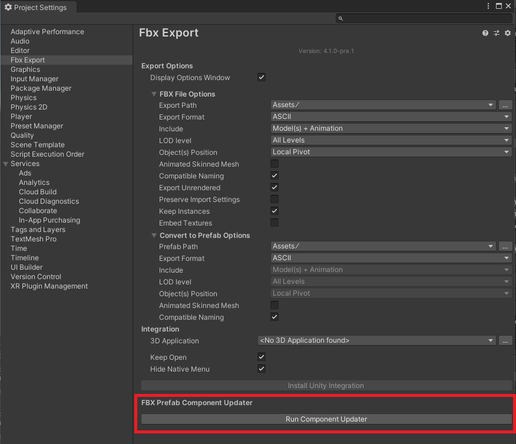

# FBX Exporter 

The FBX Exporter package provides round-trip workflows between Unity and 3D modeling software. Use this workflow to send geometry, Lights, Cameras, and animation from Unity to Autodesk® Maya®, Autodesk® Maya LT™, or Autodesk® 3ds Max®, and back again, with minimal effort.

The FBX Exporter package includes the following features:

* [FBX Exporter](exporting.md): Export geometry, animation, Lights, and Cameras as FBX files so you can transfer game data to any 3D modeling software. Record gameplay and export it to make cinematics. Start grey-boxing with [ProBuilder](https://docs.unity3d.com/Packages/com.unity.probuilder@latest/), then export to FBX to replace with final assets.

* Connections via Model Prefab Variants:
	* [Model Prefab Variants](nested-prefabs.md): 

		Unity 2018.3 introduced [Nested Prefabs](https://docs.unity3d.com/2018.3/Documentation/Manual/NestedPrefabs.html) and [Prefab Variants](https://docs.unity3d.com/2018.3/Documentation/Manual/PrefabVariants.html) as new Prefab features. The FBX Importer allows you to import an FBX file as a *Model Prefab* and create Prefab Variants from them. Since Prefab Variants can override properties and children without affecting the original Prefab, you can use them in Unity without breaking the link to the file, and bring in updates.

* [Unity Integration for 3D modeling software](integration.md): Effortlessly import and export Assets between Unity and Autodesk® Maya®, Autodesk® Maya LT™, or Autodesk® 3ds Max®. The 3D modeling software remembers where the files go, and what objects to export back to Unity.

## Requirements

The FBX Exporter package is compatible with the following versions of the Unity Editor:

* 2018.3 and later

The Unity Integration for Autodesk® Maya® and Autodesk® Maya LT™ feature supports the following versions:

* Autodesk® Maya® and Autodesk® Maya LT™ 2017
* Autodesk® Maya® and Autodesk® Maya LT™ 2018

The Unity Integration for Autodesk® 3ds Max® feature supports the following versions of Autodesk® 3ds Max®:

* Autodesk® 3ds Max® 2017
* Autodesk® 3ds Max® 2018

## Known issues

* When installing a new version of the FBX Exporter package after using version 1.3.0f1 or earlier, the link between Assets and FbxPrefab components may be lost. See [Updating from 1.3.0f1 or earlier](#Repairs_1_3_0f_1) for repairing instructions.

* The FBX Exporter package does not support exporting `.asset` files.

## Installing the FBX Exporter

To install this package, follow the instructions in the [Package Manager documentation](https://docs.unity3d.com/Packages/com.unity.package-manager-ui@latest).

Verify that the FBX Exporter is correctly installed by opening it (from the top menu: **GameObject** > **Export To FBX**).

### Updating from 1.3.0f1 or earlier

If your previous version of the FBX Exporter package was version 1.3.0f1 or earlier, follow these steps for updating:

Before you install the FBX Exporter Package, follow these steps (recommended):

1. Back up your Project.

2. Restart Unity.

3. Delete the *FbxExporters* folder.

4. Install the FBX Exporter from the [Package Manager](https://docs.unity3d.com/Packages/com.unity.package-manager-ui@latest)

Some Assets in your Project may lose their FbxPrefab components. To repair this issue, follow these steps: 

1. If your Project Assets are serialized as Binary, select __Edit__ > __Project Settings__ > __Editor__ to view the Editor Settings. 

2. Change the __Asset Serialization__ mode to __Force Text__. The __Force Text__ option converts all Project Assets to text.

3. Before continuing, back up your Project.

4. Select __Edit__ > __Project Settings__ > __FBX Export__ to view the [FBX Export Settings](options.md).

  

5. Click the __Run Component Updater__ button to repair all text serialized Prefab and Scene Assets in the Project containing the FbxPrefab component.
