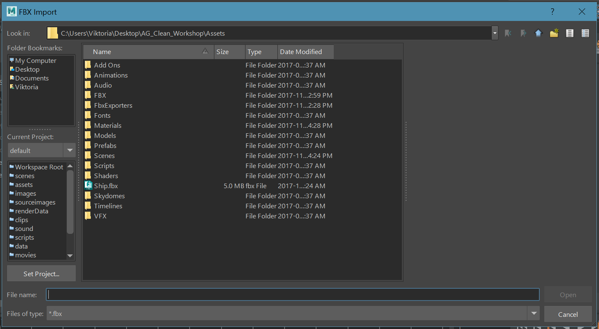
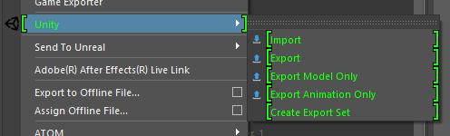
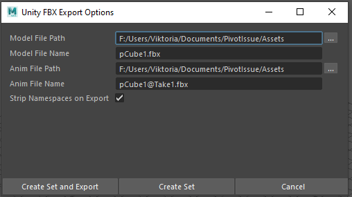
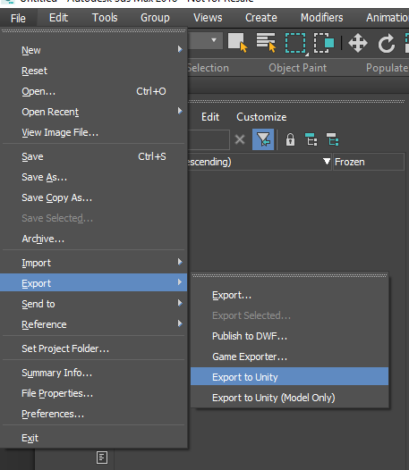

# Integrating Unity with 3D modeling software

The Unity Integration tool allows you to effortlessly exchange Assets between Unity and either **Autodesk® Maya®**, **Autodesk® Maya LT™** or __Autodesk® 3ds Max®__.

Use the Unity Integration tool to import and export FBX files directly to and from Unity without having to specify filenames, select objects, or set FBX importer or exporter settings.

To customize the FBX Importer or Exporter settings in Autodesk® Maya® or Autodesk® Maya LT™, use the `unityFbxImportSettings.mel` and `unityFbxExportSettings.mel` files. Both files are located in the `Integrations/Autodesk/maya/scripts` folder.

For Autodesk® 3ds Max®, use the `unityFbxImportSettings.ms` and `unityFbxExportSettings.ms` files located in the `Integrations/Autodesk/max/scripts` folder.

>**Important note:** These integrations are currently **only supported on Windows and Mac**.

## Installing an Integration

To install Unity Integration for Autodesk® Maya®, Autodesk® Maya LT™, or Autodesk® 3ds Max®:

1. **In Unity**, open the [Fbx Export Settings](ref-project-settings.md): from the Unity Editor main menu, select **Edit > Project Settings > Fbx Export**.

   

2. Use the __3D Application__ property to choose the 3D modeling software and version where you want to install the Unity Integration.

3. To select a version of Autodesk® Maya®, Autodesk® Maya LT™, or Autodesk® 3ds Max® installed outside the default location, click the **[...]** (Browse) button.

   

4. Before you install Unity Integration, close all instances of the selected 3D modeling software that matches the specified version.

5. Select __Install Unity Integration__ to install the Unity Integration for the selected 3D modeling software.

   **Note:** If you already unpacked a previous integration in the selected folder, Unity prompts you to either use the existing integration or to overwrite it with the newer version.

   

6. Unity Integration comes packaged in several zip files (one zip file per supported application). When prompted, select a target folder where you want to extract the Unity Integration.

   **Note:** The target folder can be outside of your current Project. Autodesk® Maya® and Autodesk® Maya LT™ both use the same zip folder.

   The application starts, configures the plug-in, and automatically exits. Unity reports whether the installation was a success.

   

If an error occurs during startup, Autodesk® Maya® or Autodesk® Maya LT™ may not close. If this happens, check the Autodesk® Maya® or Autodesk® Maya LT™ console to see if you can resolve the issue, and then manually close Autodesk® Maya® or Autodesk® Maya LT™.

If you enabled the __Keep Open__ option in the [Fbx Export Settings](ref-project-settings.md) window, then Autodesk® Maya® or Autodesk® Maya LT™ remains open after installation completes.

## Manually Installing an Autodesk® Maya® or Autodesk® Maya LT™ Integration

In some cases, you have to install your integration manually. For example, you might be using an unsupported version of Autodesk® Maya® or Autodesk® Maya LT™.

To manually install an Autodesk® Maya® or Autodesk® Maya LT™ Integration:

1. Locate the `UnityFbxForMaya.zip` file. You can find it in Unity's Project view, under the `Packages/FBX Exporter/Editor/Integrations` folder.

2. Extract the archive to a folder where you have write permission. This can be in or outside of your Unity Project.

3. Copy the contents of `Integrations/Autodesk/maya/UnityFbxForMaya.txt` from the unzipped folder to the following file:

   * On Windows: `C:\Users\\{username}\Documents\maya\modules\UnityFbxForMaya.mod`
   * On Mac: `$HOME/Library/Preferences/Autodesk/Maya/modules/UnityFbxForMaya.mod`
    

4. In `UnityFbxForMaya.mod`, modify the following line (mel code):

   `UnityFbxForMaya {Version} {UnityIntegrationsPath}/Integrations/Autodesk/maya`

   **Note:** You need to replace:
   * `{Version}` by the version number of your FBX Exporter package (for example, `4.0.1`)
   * `{UnityIntegrationsPath}` by the location where you unzipped `UnityFbxForMaya.zip` in first step.
    

5. Locate the following file (if it doesn't exist, create the file):

   * On Windows: `C:\Users\{username}\Documents\maya\scripts\userSetup.mel`
   * On Mac: `$HOME/Library/Preferences/Autodesk/Maya/scripts/userSetup.mel`
    

6. Add this line (mel code):

   ``if(`exists unitySetupUI`){ unitySetupUI; }``

7. Open Autodesk® Maya® or Autodesk® Maya LT™, and then open the Script Editor:

  

8. Run the following (mel code):

   `unityConfigure "{UnityProjectPath}" "{ExportSettingsPath}" "{ImportSettingsPath}" 0 0;`

   **Note:** You need to replace:
   * `{UnityProjectPath}` with the path to your Unity Project
   * `{ExportSettingsPath}` with the path to `Integrations/Autodesk/maya/scripts/unityFbxExportSettings.mel`
   * `{ImportSettingsPath}` with the path to `Integrations/Autodesk/maya/scripts/unityFbxImportSettings.mel`.

## Working with Autodesk® Maya® 2017+ and Autodesk® Maya LT™ 2017+

### Importing from Unity

Importing an FBX Model automatically configures the plug-in for export. The plug-in remembers your Unity Project, the export filenames for your Models and animations, and which objects to export per file.

1. Open a file browser directly in your current Unity Project: select __File__ > __Unity__ > __Import__.

   

2. Use the file browser to select the FBX files to import.

   **Note:** You can select multiple files at once: hold Shift or Ctrl to select multiple files.

   

#### Result

The FBX Exporter adds the contents of each imported file to an export set named after the imported FBX file. For example, if you import `model.fbx`, you can find its contents in an export set called `model_UnityExportSet`.

In addition, the contents of the file are placed into a namespace based on the filename. For `model.fbx`, the contents are placed into the `model:` namespace.

#### The `@` notation

Animation files that use the `@` notation (`modelname@animation.fbx`) are recognized as animation files belonging to the Model contained in `model.fbx`.

For instance, if you import a file called `model@anim.fbx`, the export set and namespace name are based on the name before the `@` symbol. Therefore, it uses the same set and namespace as `model.fbx`.

This allows animation files to be easily imported and applied to the appropriate objects in the Scene. Autodesk® Maya® and Autodesk® Maya LT™ store the animation filename and path for easy export. A single animation file is supported per model file. Importing a new animation overwrites the existing animation in the Scene.

### Exporting to Unity

There are three options available for export in Autodesk® Maya® and Autodesk® Maya LT™:

* Export
* Export Model Only
* Export Animation Only

| Option | Description |
|:-------|:------------|
| **File > Unity > Export** | Exports both the Models and animation contained in the export sets selected for export. |
| **File > Unity > Export Model Only** | Exports all Models in the selected export sets, but does not export any animation. |
| **File > Unity > Export Animation Only** | Exports only the animation applied to the objects in the export set as well as the minimum components required for the animation (such as transforms). |

To export objects from the desired export set, you can select one or more objects in the set, or the set itself. In either case, the FBX Exporter exports the entire contents of the set.

If you select multiple sets or objects from multiple sets, then the FBX Exporter exports each set to its respective file defined in the attributes of the set.

### Creating a New Export Set in Maya

To export objects that are not part of an existing export set, you need to prepare a new export set. To do this, follow these steps:

1. Select the desired objects for export.

2. Select **File > Unity** and then select one of the following menu items:

   

   * Select **Create Export Set** OR **Export** to create an export set with settings for exporting animation and model FBX files,
      OR
   * Select **Export Model Only** OR **Export Animation Only** to setup an export set for exporting a model or animation file.

3. Use the window that opens to set the options for the export set:

   

   | Property | Function |
   |:---------|:---------|
   | **Model File Path** | The file path to export to when you select **File > Unity > Export** or **File > Unity > Export Model Only**. |
   | **Model File Name** | The name of the file to export to when you select **File > Unity > Export** or **File > Unity > Export Model Only**. |
   | **Anim File Path** | The file path to export to when you select **File > Unity > Export Animation Only**. |
   | **Anim File Name** | The name of the file to export to when you select **File > Unity > Export Animation Only**. |
   | **Strip Namespaces on Export** | Enable this option to automatically strip the most common namespace in the set on export.  For example, if you enable this option and most objects are in namespace `model:`, then `model:` is stripped on export. |

   | Action button | Function |
   |:--------------|:---------|
   | **Create Set And Export** | Creates the set and immediately exports the selection. |
   | **Create Set** | Creates the set without exporting. |
   | **Cancel** | Cancels the set creation and closes the window. |

### Editing Export Set Attributes

After you created an export set (through **File > Unity > Import** or **File > Unity > Create Export Set**, or one of the export options), you can edit the export options
on the set.

To do so, select the set, and in the **Attribute Editor**, in the **Extra Attributes** section, modify the Unity attributes.

> **NOTE:** If Arnold is installed, the attributes might appear in the **Arnold > Extra Attributes** section.

| Property | Function |
| :------- | :------- |
| **Unity Fbx Model File Path** | The file path to export to when you select **File > Unity > Export** or **File > Unity > Export Model Only**. |
| **Unity Fbx Model File Name** | The name of the file to export to when you select **File > Unity > Export** or **File > Unity > Export Model Only**. |
| **Unity Fbx Anim File Path**  | The file path to export to when you select **File > Unity > Export Animation Only**. |
| **Unity Fbx Anim File Name**  | The name of the file to export to when you select **File > Unity > Export Animation Only**. |
| **Unity Fbx Strip Namespace** | Enable this option to automatically strip the most common namespace in the set on export.  For example, if you enable this option and most objects are in namespace `model:`, then the export strips `model:`.  If you want to strip another namespace instead of the most common one, you can type it in the **Strip Specific Namespace** field. |
| **Strip Specific Namespace** | (Optional) Use this property to specify the namespace to strip on export when you enable the **Unity Fbx Strip Namespace** option, instead of the most common namespace.  If you leave this field empty, the **Unity Fbx Strip Namespace** option uses by default the most common namespace in the set.|

## Working with Autodesk® 3ds Max® 2017+

### Importing from Unity

Importing an FBX Model automatically configures the plug-in for export. The plug-in remembers your Unity Project, the export filename, and which objects to export.

1. Select **Import** to open a file browser directly in your current Unity Project:

   * In Autodesk® 3ds Max® 2018 or later, select **File > Import > Import from Unity**.

     

   * In Autodesk® 3ds Max® 2017, select **Unity > Import**.

     

2. Use the file browser to select the Models to import.

   **Note:** You can select multiple files at once: hold Shift or Ctrl to select multiple files.

   

#### Result

The FBX Exporter automatically adds the contents of each imported file to a selection set named after the imported FBX file. For example, if you import `model.fbx`, you can find its contents in a selection set called `model_UnityExportSet`.

The FBX Exporter also creates a dummy with the same name (`model_UnityExportSet`) for each imported file and parents it under another dummy object called `UnityFbxExportSets`.

This dummy contains the imported file’s path and filename as custom attributes, which the FBX Exporter also uses on export.

#### The `@` notation

The `@` notation (`modelname@animation.fbx`), indicates that this is an animation file belonging to the Model contained in `model.fbx`.

For instance, if you import a file called `model@anim.fbx`, the export set is based on the name before the `@` symbol. Therefore, it uses the same set as `model.fbx`.

This allows you to easily import animation files and apply them to the appropriate objects in the Scene. A single animation file is supported per Model file. Importing a new animation overwrites the existing animation in the Scene.

#### Limitation

You cannot export animation only from Autodesk® 3ds Max®.

#### System units

If the system units are not set to centimeters, Autodesk® 3ds Max® prompts you to change them:

* Click __Yes__ to change the system units to centimeters (recommended). This ensures to maintain the scaling on export.

  OR

* Click __No__ to use the current system units (not recommended). The prompt does not appear again for the remainder of the Autodesk® 3ds Max® session or, in the case of a `.max` file, does not appear again for this file.

### Exporting to Unity

There are two options available for export in Autodesk® 3ds Max®:

| Option | Description |
|:-------|:------------|
| **Export** | Exports both the Models and animation contained in the export sets selected for export. |
| **Export Model Only** | Exports all Models in the selected export sets, but does not export any animation. |

Both options automatically export the files with the settings and Models you configured during import. To use them:

* In Autodesk® 3ds Max® 2018 or later, from the menu, select **File > Export** and then choose **Export to Unity** or **Export to Unity (Model Only)**.

  

* In Autodesk® 3ds Max® 2017, from the menu, select **Unity**  and then choose **Export** or **Export Model Only**.

  

To export objects from the desired export set, you can select one or more objects in the set, the set itself, or the corresponding dummy object. In either case, the FBX Exporter exports the entire contents of the set.

If you select multiple dummy objects corresponding to sets or objects from multiple sets, then the FBX Exporter exports each set to its respective file defined in the custom attributes of the set’s dummy object.

In each case, the __Export__ option automatically exports the current Model back to Unity. When you switch back to Unity, your Scene has already been updated.

#### Sets and objects to export

Unity export uses the selection sets created on import to determine which objects to export. If you add a new object to the Model, you must also add this new object to the Model’s *UnityExportSet* set.

* To edit a *UnityExportSet* set, select **Manage Selection Sets**.

  

* To add an object to a set, select the set, select an object and select **Add Selected Objects**.

* To remove an object from a set, select the object in the set and select **Subtract Selected Objects**.

> **TIP:** You can also right-click the UnityExportSets and add or remove objects through the context menu.

In Autodesk® 3ds Max®, use the **Add Selected Objects** button (red outline) to add objects to the *Wolf_UnityExportSet* set.
