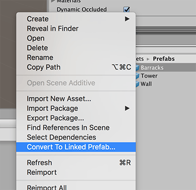
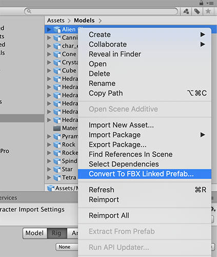

# Working with Model Prefab Variants

When a user imports a Model from a 3D modeling application such as Autodesk® Maya®, it is represented in Unity as a *Model Prefab*. You can't edit Model Prefabs in Unity, apart from [changing the import settings](https://docs.unity3d.com/2018.3/Documentation/Manual/class-FBXImporter.html). If someone saves changes to that Model file in an external application, the FBX Importer automatically updates the imported Model Prefab. 

You can add components to a Model Prefab in the Scene, such as a collider. However, you cannot apply any change back to the Asset without breaking the link. In this way, a Model Prefab is a *read-only* Prefab, because it is non-editable except for overrides in the Scene.

Using Model Prefab Variants is the best way to ensure that your Models continue to reflect any changes you make to your FBX files in external applications while still taking full advantage of the Prefab system. For example, while Linked Prefabs required the extra **FbxPrefab** component, Model Prefab Variants use only the Unity Prefab features. And you can create Variants of your Variants which all receive updates from the Model Prefab but provide a lot of flexibility. 

In addition, Variants give you some additional control over receiving updates from external applications. For example, if you have a Model with a Spot Light of size 10 and you override the size to 1 in your Variant, when the size and color change in the FBX file, the color will change but the size will remain 1.

> ***Important:*** Because the Prefab Variant inherits data from the base Model Prefab, you cannot make structural changes to the Prefab Variant. This means that you cannot delete inherited child objects or re-arrange the order of inherited child objects on the Prefab Variant. 

## Creating a Model Prefab Variant

You can either create a Model Prefab Variant Instance [from a GameObject](#fromGameObject) or generate a Model Prefab Variant directly [from the selected .fbx or .prefab file](#fromFBXorAssetFile).

When you convert a GameObject to a Model Prefab Variant instance, the FBX Exporter exports each selected GameObject hierarchy and writes an FBX file and a Prefab Variant (`.prefab`) with the FBX as its base. 

When you generate a Model Prefab Variant from a selected file, the FBX Exporter generates the Model Prefab Variant without modifying the Scene. If you selected an FBX file, a Prefab Variant Asset file is generated. If you selected a Prefab Asset file, a Prefab Variant Asset file and an FBX file are generated.

### Converting a GameObject

To replace the GameObject hierarchy with an instance of a Model Prefab Variant: 

1. Right-click on the GameObject in the Hierarchy view and select __Convert To Model Prefab Variant Instance__ from the context menu.

	

	Alternatively, you can use the main menu: __GameObject__ > __Convert To Model Prefab Variant Instance__ with the GameObject selected.

2. Specify how you want to export the GameObject using the properties on the [Convert Options](#ConvertOptions) window and click **Convert**.

Model Prefab Variants use the same rules as for exporting: all selected objects and their descendants are exported to a single FBX file. If you select both a parent and a descendant, the Model Prefab Variant only exports the parent’s hierarchy.

> ***Note:*** If the selected object is already linked to an existing FBX file, then the hierarchy is not re-exported: instead the Model Prefab Variant links to the FBX file that already exists.

### Converting an FBX file or a Prefab

To generate the Model Prefab Variant from the selected file without modifying the scene:

1. Right-click on an FBX or Prefab Asset file in the Project view and select __Convert To Model Prefab Variant__ from the context menu.

	

	Alternatively, you can use the main menu: __Assets__ > __Convert To Model Prefab Variant__.

2. Specify how you want to export the GameObject using the properties on the [Convert Options](#ConvertOptions) window and click **Convert**.

Depending on which type of file you selected, the FBX Exporter creates the Model Prefab Variant in one of the following ways:

* If an FBX file is selected, a Model Prefab Variant file is generated with the selected FBX file as its base.
* If a Prefab Asset file is selected, the Prefab is exported to an FBX file and a new Model Prefab Variant is created.

## Convert Options window

When converting to a Model Prefab Variant, the following window opens, displaying options for exporting:

### Convert Option Properties

| Property:                 | Function:                                                    |
| :------------------------ | :----------------------------------------------------------- |
| __Export Name__           | Specify the name of the FBX file to export.                  |
| __Export Path__           | Specify the location where the FBX Exporter will save the FBX file. |
| __Prefab Name__           | Specify the name of the Model Prefab Variant's file.                |
| __Prefab Path__           | Specify the location where the FBX Exporter will save the Model Prefab Variant file. |
| __Source__                | Transfer the transform animation from this object to the __Destination__ transform.  **Notes:**  - __Source__ must be an ancestor of __Destination__.  - __Source__ may be an ancestor of the selected object. |
| __Destination__           | Which object to transfer the transform animation to.  This object receives the transform animation on objects between __Source__ and __Destination__ as well as the animation on the __Source__ itself. |
| __Export Format__         | Select the format for the FBX Exporter to use when exporting the FBX file (ASCII or binary). |
| __Include__               | __Convert to Model Prefab Variant Instance__ always exports both Models and Animation in the hierarchy. |
| __LOD level__             | __Convert to Model Prefab Variant Instance__ always exports All levels of detail (LOD) available in the hierarchy for LOD groups. |
| __Object(s) Position__    | __Convert to Model Prefab Variant Instance__ always resets the root object's transform during export. However, the Prefab maintains the global transform for the root object. |
| __Animated Skinned Mesh__ | Check this option to export animation on objects with skinned meshes.  If unchecked, the FBX Exporter does not export animation on skinned meshes. |
| __Compatible Naming__     | Check this option to control renaming the GameObject and Materials during export.   The FBX Exporter ensures compatible naming with Autodesk® Maya® and Autodesk® Maya LT™ to avoid unexpected name changes between Unity and Autodesk® Maya® and Autodesk® Maya LT™. During export the FBX Exporter replaces characters in Unity names as follows:  - Replaces invalid characters with underscores ("\_"). Invalid characters are all non-alphanumeric characters, except for colon (":").  - Adds an underscore ("\_") to names that begin with a number. - Replaces diacritics. For example, replaces "é" with “e”.  **Note:** If you have a Material with a space in its name, the space is replaced with an underscore ("_"). This results in a new Material being created when it is imported. For example, the Material named "Default Material" is exported as "Default_Material" and is created as a new Material when it is imported. If you want the exported Material to match an existing Material in the scene, you must manually rename the Material before exporting. |
| __Don't ask me again__    | Check this option to use the same **Convert Option** properties and hide this window when converting to Linked Prefabs in the future. You can reset this option by turning on the **Show Convert UI** option under **Edit** > **Project Settings** > **Fbx Export** in Unity's top menu. |

> ***Note:*** For FBX Model filenames, the FBX Exporter ensures that names do not contain invalid characters for the file system. The set of invalid characters may differ between file systems.

## Known issues

* Name or path changes are ignored when converting a Model instance.

## Converting from Linked Prefabs to Prefab Variants

To convert existing Linked Prefabs to Prefab Variants, follow these steps:

1. Fix any name discrepancies that were previously handled by the [name remapping functionality for Linked Prefabs](prefabs.md#Remapping) before converting. Prefab Variants do not handle name remapping. If you start to add game logic to components, and then the objects in the FBX get renamed, you are at risk of losing the components. This can happen because the old GameObjects are deleted and new objects with the new names are added in their place.

2. Delete the FbxPrefab component from the prefab.

3. Right-click the Linked Prefab file and select **Convert to Model Prefab Variant** from the context menu.

	

> ***Note:*** This will reexport the Linked Prefab to a new FBX file, and it will no longer be connected to the original.