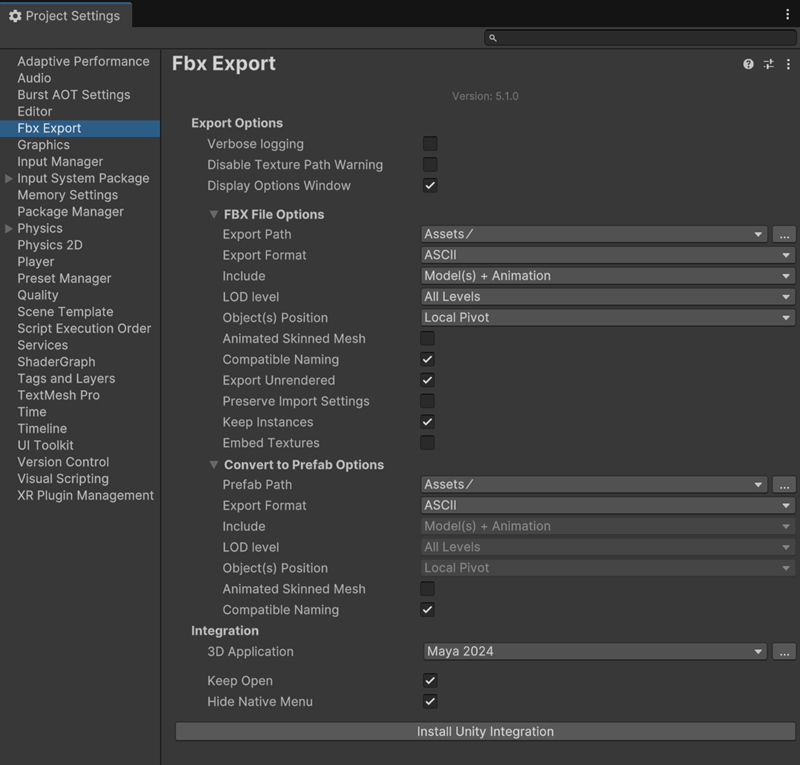

# FBX Export settings

Use the Fbx Export Settings window to show or hide the Convert to Model Prefab Variant UI and to install the [Unity Integration](integration.html) for Autodesk® Maya®, Autodesk® Maya LT™, or Autodesk® 3ds Max®.

## Fbx Export Settings window

| Property:                     | Function:                                                    |
| :---------------------------- | :----------------------------------------------------------- |
| __Show Convert UI__              | Check this option to hide the Convert to Model Prefab Variant UI when converting. The last selected path will be used and the filename will be based on the selected object's name. |
| __3D Application__            | Select the 3D modeling software you want to integrate with Unity. Autodesk® Maya® 2017+, Autodesk® Maya LT™ 2017+, and Autodesk® 3ds Max® 2017+ are the three applications currently supported.  Click the Browse button to choose a 3D modeling software installed in a non-standard location. |
| __Keep Open__                 | Check this option to keep the selected 3D modeling software open after installing it. |
| __Hide Native Menu__          | Check this option to hide the native __Send to Unity__ menu in Autodesk® Maya® and Autodesk® Maya LT™. |
| __Install Unity Integration__ | Click this button to install [Unity Integration](integration.html) for the selected __3D Application__. |
| __Run Component Updater__     | Click this button to run the [Component Updater](index.html#Repairs_1_3_0f_1) to repair any missin FbxPrefab components if you were using version 2.0.1-preview or earlier of the FBX Exporter package. |

