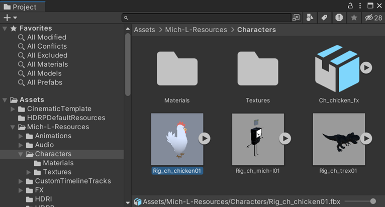

# FBX files and Prefab Variants

Summary of Unity core concepts about FBX files, Model Prefabs, and Prefab Variants.

## FBX file and Model Prefab

When you [import an FBX file](https://docs.unity3d.com/Manual/ImportingModelFiles.html) in a Unity project, or when you [create one by export](export-gameobjects.md), the Editor automatically creates a read-only Model Prefab to represent the FBX file contents in a way that is compatible with Unity's Prefab system.

However, the Editor's Project window always displays a single asset that represents both the FBX file and the Model Prefab.

### Model Prefab management

You can adjust the way Unity handles the Model Prefab created from an FBX file by [changing the import settings](https://docs.unity3d.com/Documentation/Manual/class-FBXImporter.html), but you can't edit the Model Prefab with the Unity Editor, contrary to a Unity Prefab.

You can instantiate a Model Prefab in a Scene if it suits your needs as is. However, if you need to override some of the Model Prefab properties, or further adapt the Model Prefab to your project beyond the importer capabilities, a best practice is to first create a Prefab Variant based on the Model Prefab and then instantiate the created Prefab Variant instead of the Model Prefab.

### FBX file edit

You can open an FBX file stored in your Unity project using a 3D modeling application such as Autodesk® Maya®. Once you edit and save the FBX file via the 3D modeling application, Unity automatically updates the corresponding Model Prefab in your project.

## Prefab Variant

A Prefab Variant is a Prefab based on another Prefab that it is connected to.

* When you change the structure and properties of the base Prefab, the Prefab Variant inherits from these changes.

* When you override a property in a Prefab Variant, it doesn't affect the base Prefab. The Prefab Variant continues to inherit from the changes applied to the base Prefab, except for the overridden property.

### FBX Prefab Variant

"FBX Prefab Variant" is a simplified terminology to name a Prefab Variant based on an FBX Model Prefab. This type of asset is not different from any other Prefab Variant based on a Unity Prefab.

## Additional resources

* [FBX Prefab Variant workflow](prefab-variants-workflow.md)
* [Prefab Variants](https://docs.unity3d.com/Documentation/Manual/PrefabVariants.html)
* [Export to FBX](export-gameobjects.md)
* [Importing a model](https://docs.unity3d.com/Manual/ImportingModelFiles.html)
