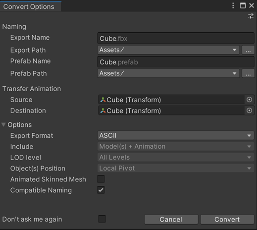

# Working with Prefabs

In Unity, [Nested Prefabs](https://docs.unity3d.com/Documentation/Manual/NestedPrefabs.html) allow you to create Prefabs inside other Prefabs, and [Prefab Variants](https://docs.unity3d.com/Documentation/Manual/PrefabVariants.html) allow you to save a variation on an existing Prefab. 

When Unity imports a Model from a 3D modeling application such as Autodesk® Maya®, Unity creates a **Model Prefab**, which is a read-only representation of the FBX file's contents. You can't edit Model Prefabs in Unity, apart from [changing the import settings](https://docs.unity3d.com/2018.3/Documentation/Manual/class-FBXImporter.html). When the FBX file is modified inside the originating 3D modeling software, Unity updates the Model Prefab. 

If you want to add components, Materials, or change most other property values without affecting the original FBX file in Unity, convert the Model Prefab to an **FBX Prefab Variant**. This is a Prefab Variant of the exported FBX's Model Prefab. Prefab Variants allow you to override their base Prefabs' properties.

Using FBX Prefab Variants is the best way to ensure that your Models continue to reflect any changes you make to your FBX files in external applications while still taking full advantage of the Prefab system.

In addition, you can use Variants to control updates from external applications. For example, if you have a Model with a Spot Light of size 10 and you override the size to 1 in your Variant, when the size and color change in the FBX file, the color changes but the size remains 1.

> **IMPORTANT:** Because the Prefab Variant inherits data from the base Model Prefab, you cannot make structural changes to the Prefab Variant. This means that you cannot delete inherited child objects or re-arrange the order of inherited child objects on the Prefab Variant. 

### Creating an FBX Prefab Variant

You can either create an FBX Prefab Variant [from a GameObject](#fromGameObject) or generate it directly [from the selected .fbx or .prefab file](#fromFBXorAssetFile). If you are upgrading from version 2.0.1-preview or earlier of the FBX Exporter, you can also [convert any existing](#conversion) Linked Prefabs you may have to the new FBX Prefab Variants.

When you convert a GameObject to an FBX Prefab Variant, the FBX Exporter exports each selected GameObject hierarchy and writes an FBX file and a Prefab Variant (`.prefab`) with the FBX as its base. 

When you generate an FBX Prefab Variant from a selected file, the FBX Exporter generates the FBX Prefab Variant without modifying the Scene: 

* If you select an FBX file, the FBX Exporter generates a Prefab Variant Asset file. 
* If you select a Prefab Asset file, the FBX Exporter generates a Prefab Variant Asset file and an FBX file.

#### Converting a GameObject

To replace the GameObject hierarchy with an instance of an FBX Prefab Variant: 

1. Right-click on the GameObject in the Hierarchy view and select __Convert To FBX Prefab Variant__ from the context menu.

	

	Alternatively, you can use the main menu: __GameObject__ > __Convert To FBX Prefab Variant__ with the GameObject selected.

2. Specify how you want to export the GameObject using the properties on the [Convert Options](#ConvertOptions) window and click **Convert**.

FBX Prefab Variants use the same rules as for exporting: all selected objects and their descendants are exported to a single FBX file. If you select both a parent and a descendant, the FBX Prefab Variant only exports the parent’s hierarchy.

> **NOTE:** If the selected object is a Model Prefab instance, then the hierarchy is not re-exported: instead the FBX Prefab Variant links to the FBX file that already exists.

#### Converting an FBX file or a Prefab

To generate the FBX Prefab Variant from the selected file without modifying the Scene:

1. Right-click on an FBX or Prefab Asset file in the Project view and select __Convert To FBX Prefab Variant__ from the context menu.

	

	Alternatively, you can use the main menu: __Assets__ > __Convert To FBX Prefab Variant__.

2. Specify how you want to export the GameObject using the properties on the [Convert Options](#ConvertOptions) window and click **Convert**.

Depending on which type of file you selected, the FBX Exporter creates the FBX Prefab Variant in one of the following ways:

* If an FBX file is selected, the FBX Exporter generates a Prefab Variant file with the selected FBX file as its base.
* If a Prefab Asset file is selected, the FBX Exporter exports the Prefab to an FBX file and creates a new FBX Prefab Variant.

### Convert Options window

When converting to an FBX Prefab Variant, the following window opens, displaying options for exporting:

#### Convert Option properties

| Property:                 | Function:                                                    |
| :------------------------ | :----------------------------------------------------------- |
| __Export Name__           | Specify the name of the FBX file to export.                  |
| __Export Path__           | Specify the location where the FBX Exporter will save the FBX file. |
| __Prefab Name__           | Specify the name of the FBX Prefab Variant's file.            |
| __Prefab Path__           | Specify the location where the FBX Exporter will save the FBX Prefab Variant file. |
| __Source__                | Transfer the transform animation from this object to the __Destination__ transform.  **NOTES:**  - __Source__ must be an ancestor of __Destination__.  - __Source__ may be an ancestor of the selected object. |
| __Destination__           | Which object to transfer the transform animation to.  This object receives the transform animation on objects between __Source__ and __Destination__ as well as the animation on the __Source__ itself. |
| __Export Format__         | Select the format for the FBX Exporter to use when exporting the FBX file (ASCII or binary). |
| __Include__               | __Convert to FBX Prefab Variant__ always exports both Models and Animation in the hierarchy. |
| __LOD level__             | __Convert to FBX Prefab Variant__ always exports All levels of detail (LOD) available in the hierarchy for LOD groups. |
| __Object(s) Position__    | __Convert to FBX Prefab Variant__ always resets the root object's transform during export. However, the Prefab maintains the global transform for the root object. |
| __Animated Skinned Mesh__ | Check this option to export animation on objects with skinned meshes.  If unchecked, the FBX Exporter does not export animation on skinned meshes. |
| __Compatible Naming__     | Check this option to control renaming the GameObject and Materials during export.   The FBX Exporter ensures compatible naming with Autodesk® Maya® and Autodesk® Maya LT™ to avoid unexpected name changes between Unity and Autodesk® Maya® and Autodesk® Maya LT™. During export the FBX Exporter replaces characters in Unity names as follows:  - Replaces invalid characters with underscores ("\_"). Invalid characters are all non-alphanumeric characters, except for colon (":").  - Adds an underscore ("\_") to names that begin with a number. - Replaces diacritics. For example, replaces "é" with “e”.  **NOTE:** If you have a Material with a space in its name, the space is replaced with an underscore ("_"). This results in a new Material being created when it is imported. For example, the Material named "Default Material" is exported as "Default_Material" and is created as a new Material when it is imported. If you want the exported Material to match an existing Material in the scene, you must manually rename the Material before exporting. |
| __Don't ask me again__    | Check this option to use the same **Convert Option** properties and hide this window when converting to FBX Prefab Variants in the future. You can reset this option by turning on the **Show Convert UI** option under **Edit** > **Project Settings** > **Fbx Export** in Unity's top menu. |

> **NOTE:** For FBX Model filenames, the FBX Exporter ensures that names do not contain invalid characters for the file system. The set of invalid characters may differ between file systems.

### Converting from Linked Prefabs to FBX Prefab Variants

To convert existing Linked Prefabs to FBX Prefab Variants, follow these steps:

1. Fix any name discrepancies before converting. FBX Prefab Variants do not handle name remapping. If you start to add game logic to components, and then the objects in the FBX get renamed, you are at risk of losing the components. This can happen because the old GameObjects are deleted and new objects with the new names are added in their place.

2. Right-click the Linked Prefab file and select **Convert to FBX Prefab Variant** from the context menu.

	

> **NOTE:** This re-exports the Linked Prefab to a new FBX file, and it is no longer connected to the original FBX.
