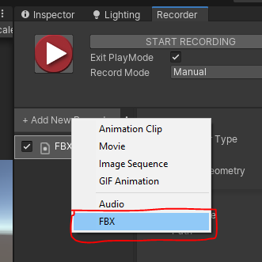
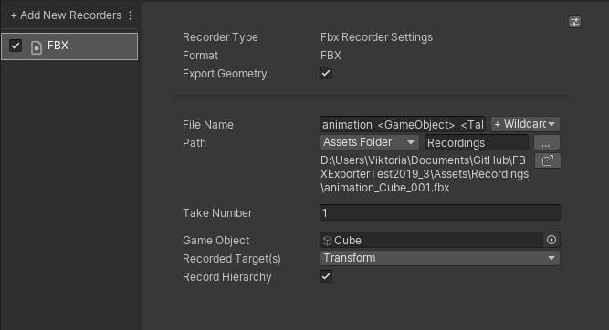

# Using the FBX Recorder

With the FBX Exporter and the [Unity Recorder](https://docs.unity3d.com/Packages/com.unity.recorder@latest/), you can export animations (including [Cinemachine](https://docs.unity3d.com/Packages/com.unity.cinemachine@latest/) camera animations) directly to FBX files.

## Requirements

* To use the FBX Recorder, you must install the [Unity Recorder](https://docs.unity3d.com/Packages/com.unity.recorder@latest/) package (version 2.5.5 or higher).

## Using the FBX Recorder from the Recorder window

1. Open the Recorder window: select **Window > General > Recorder > Recorder Window**.

2. In the Recorder window, add a new FBX recorder: select **Add Recorder**, and then select **FBX**.

   

3. Set the GameObject to record as well as the other [recorder properties](#fbx-recorder-properties) according to your needs.

4. Select **Start Recording**.

> **Note:** Alternatively, you can use the FBX Recorder through a [Recorder Clip](https://docs.unity3d.com/Packages/com.unity.recorder@latest/RecordingTimelineTrack.md) in a [Timeline](https://docs.unity3d.com/Packages/com.unity.timeline@latest) track.

## FBX Recorder properties

This section covers all properties specific to the FBX Recorder type.

> **Note:** To fully configure an FBX Recorder, you must also set the general recording Properties for the capture (properties shared with the other recorders, such as the frames to record). The [Unity Recorder documentation](https://docs.unity3d.com/Packages/com.unity.recorder@latest/index.html) describes these properties in detail.

The FBX Recorder properties fall into three main categories:
* [Capture](#capture)
* [Format](#format)
* [Output File](#output-file)

## Capture

Define the source and the content of your recording.

|Property||Function|
|:---|:---|:---|
| **GameObject** ||The [GameObject](https://docs.unity3d.com/Manual/class-GameObject.html) to record.|
| **Recorded Component(s)** ||The components of the GameObject to record. Choose more than one item to record more than one component.  **Note:** The FBX Recorder can only export the same component properties as the [animation export feature of the FBX Exporter](exporting.md#animation). |
| **Record Hierarchy** ||Enable this property to record the GameObject's child GameObjects.|
| **Clamped Tangents** || Enable this option to set all [key tangents](https://docs.unity3d.com/Manual/EditingCurves.html) of the recorded animation to **Clamped Auto**. Disabling the option sets the tangents to **Auto** (legacy). Clamped tangents are useful to prevent curve overshoots when the animation data is discontinuous. |
| **Anim. Compression** || Specifies the keyframe reduction level to use to compress the recorded animation curve data. |
| | Lossy | Applies an overall keyframe reduction. The Recorder removes animation keys based on a relative tolerance of 0.5 percent, to overall simplify the curve. This reduces the file size but directly affects the original curve accuracy. |
| | Lossless | Applies keyframe reduction to constant curves only. The Recorder removes all unnecessary keys when the animation curve is a straight line, but keeps all recorded keys as long as the animation is not constant. |
| | Disabled | Disables the animation compression. The Recorder saves all animation keys throughout the recording, even when the animation curve is a straight line. This might result in large files and slow playback. |

## Format

|Property|Function|
|:---|:---|
| **Format** | The FBX Recorder always generates an FBX file. |
| **Export Geometry** | Use this option to export the geometry of the recorded GameObject to FBX, if any. |

### Transfer Animation

|Property|Function|
|:---|:---|
| **Source** | The object to transfer the transform animation from.   **Note:** • **Source** must be an ancestor of **Destination**. • **Source** may be an ancestor of the selected object. |
| **Destination** | The object to transfer the transform animation to.  This object receives the transform animation on objects between **Source** and **Destination** as well as the animation on the **Source** itself. |

## Output File

Specify the output **Path** and **File Name** pattern to save the recorded images.

> **Note:** Output File properties work the same for all types of recorders. The [Unity Recorder documentation](https://docs.unity3d.com/Packages/com.unity.recorder@latest/index.html) describes these properties in detail.
