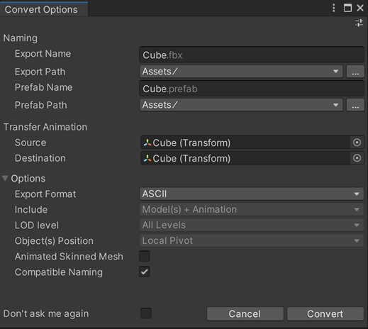

# Convert Options window

When [converting to an FBX Prefab Variant](prefab-variants.md), the following window opens, displaying options for exporting:

## Naming

| Property | Function |
| :--- | :--- |
| **Export Name** | The name of the FBX file to export. |
| **Export Path** | The location where the FBX Exporter saves the converted FBX file. |
| **Prefab Name** | The name of the FBX Prefab Variant's file. |
| **Prefab Path** | The location where the FBX Exporter saves the FBX Prefab Variant file. |

## Transfer Animation

| Property | Function |
| :--- | :--- |
| **Source** | Transfer the transform animation from this object to the **Destination** transform.  **NOTES:**  - **Source** must be an ancestor of **Destination**.  - **Source** may be an ancestor of the selected object. |
| **Destination** | Which object to transfer the transform animation to.  This object receives the transform animation on objects between **Source** and **Destination** as well as the animation on the **Source** itself. |

## Options

| Property | Function |
| :--- | :--- |
| **Export Format** | Select the format for the FBX Exporter to use when exporting the FBX file (ASCII or binary). |
| **Include** | **Convert to FBX Prefab Variant** always exports both Models and Animation in the hierarchy. |
| **LOD level** | **Convert to FBX Prefab Variant** always exports All levels of detail (LOD) available in the hierarchy for LOD groups. |
| **Object(s) Position** | **Convert to FBX Prefab Variant** always resets the root object's transform during export. However, the Prefab maintains the global transform for the root object. |
| **Animated Skinned Mesh** | Enable this option to export animation on GameObjects with skinned meshes.  If you disable this option, the FBX Exporter does not export animation on skinned meshes. |
| **Compatible Naming** | Enable this option to make the FBX Exporter rename GameObjects and Materials on conversion, according to specific [character replacement rules](export-compatible-naming.md).  This ensures a compatible naming with Autodesk® Maya® and Autodesk® Maya LT™ to avoid unexpected name changes between Unity and these software. |
| **Don't ask me again** | Enable this option to use the same **Convert Options** properties and hide this window when converting to FBX Prefab Variants in the future. You can reset this option by turning on the **Display Options Window** option under **Edit** > **Project Settings** > **Fbx Export** in Unity's top menu. |

> **Note:** For FBX Model filenames, the FBX Exporter ensures that names do not contain invalid characters for the file system. The set of invalid characters might differ between file systems.

## Default property values

If you set a Default Preset in the Preset Manager, the FBX Exporter automatically uses the values of this Preset as default property values. Otherwise, the FBX Exporter falls back to the values defined in [FBX Export Project Settings](ref-project-settings.md).

However, if you modify the settings in the Convert Options window during a conversion, the FBX Exporter preserves them as long as you keep the Unity Editor session open.
