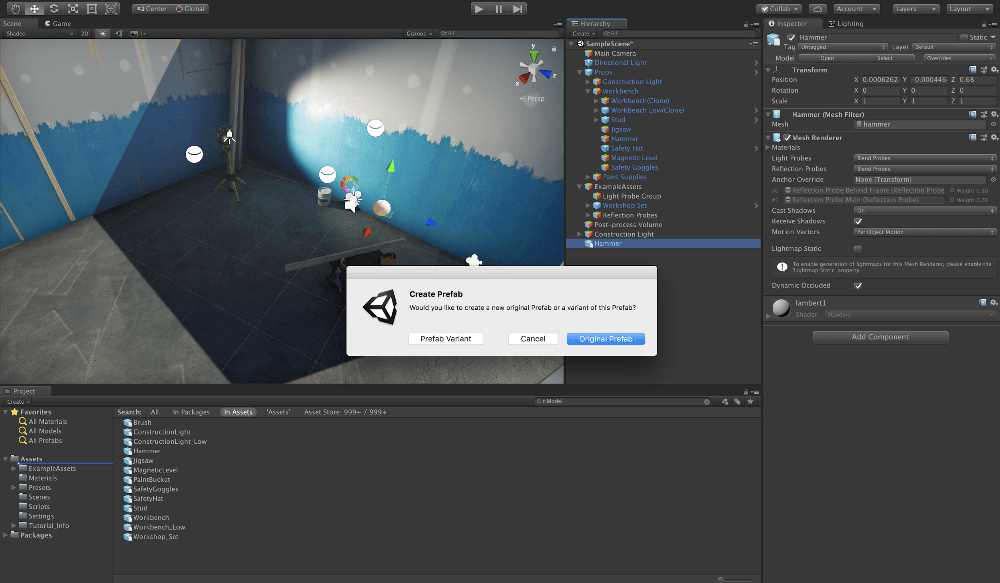

# Working with Model Prefab Variants

> ***Note:*** Prefab Variants are only available in Unity version 2018.3. If you are using Unity version 2018.2, use [Linked Prefabs](prefabs.md) instead. 

When a user imports a Model from a 3D modeling application such as Autodesk® Maya®, it is represented in Unity as a *Model Prefab*. You can't edit Model Prefabs in Unity, apart from [changing the import settings](https://docs.unity3d.com/2018.3/Documentation/Manual/class-FBXImporter.html). If someone saves changes to that Model file in an external application, the FBX Importer automatically updates the imported Model Prefab. 

You can add components to a Model Prefab in the Scene, such as a collider. However, you cannot apply any change back to the Asset without breaking the link. In this way, a Model Prefab is a *read-only* Prefab, because it is non-editable except for overrides in the Scene.

Using Model Prefab Variants is the best way to ensure that your Models continue to reflect any changes you make to your FBX files in external applications while still taking full advantage of the Prefab system. For example, while Linked Prefabs required the extra **FbxPrefab** component, Model Prefab Variants use only the Unity Prefab features. And you can create Variants of your Variants which all receive updates from the Model Prefab but provide a lot of flexibility. 

In addition, Variants give you some additional control over receiving updates from external applications. For example, if you have a Model with a Spot Light of size 10 and you override the size to 1 in your Variant, when the size and color change in the FBX file, the color will change but the size will remain 1.

> ***Important:*** Because the Prefab Variant inherits data from the base Model Prefab, you cannot make structural changes to the Prefab Variant. This means that you cannot delete inherited child objects or re-arrange the order of inherited child objects on the Prefab Variant. 

## Creating a Model Prefab Variant

 by  and choosing “Prefab Variant”. 

You can create a unidirectional link between your external 3D modeling application and your Unity Scene by setting up a Model Prefab Variant to inherit all changes from the Model Prefab. This means that updates to the FBX Model file will flow through to the Prefab. 

To create Prefab Variant from a Model Prefab: 

1. If you haven't already created a Prefab Model from the FBX Model file, drag the FBX file from the Project view into the Scene Hierarchy.

	A Model Prefab  appears in the Hierarchy view.

2. Drag the Prefab Model from the Scene Hierarchy to the Project view.

	A dialog box prompts you to choose how you want to create the Prefab.

	

3. Click the **Prefab Variant** button.

  The Model Prefab now appears as a Prefab Variant  in both the Scene and Hierarchy views.

## Converting from Linked Prefabs to Prefab Variants

To convert existing Linked Prefabs to Prefab Variants, follow these steps:

1. Fix any name discrepancies that were previously handled by the [name remapping functionality for Linked Prefabs](prefabs.md#Remapping) before converting.

2. Right-click the FBX file and select **Prefab Variant** from the context menu.

	

3. Copy any components from the old Linked Prefab onto the new Prefab Variant.
