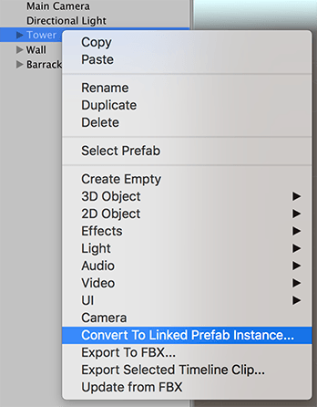

# Working with Linked Prefabs

> ***Note:*** Linked Prefabs are only available in Unity version 2018.2. If you are using Unity version 2018.3, use [Model Prefab Variants](nested-prefabs.md) instead. 

A **Linked Prefab** is a [Prefab](https://docs.unity3d.com/2018.3/Documentation/Manual/Prefabs.html) which maintains a link to an FBX file and is responsible for updating the Prefab so that it remains in sync with its source. The notable difference between a Linked Prefab and a stock Unity Prefab is that the Linked Prefab integrates changes in the hierarchy and transforms (in addition to Meshes and Materials). 

During an update, the Linked Prefab preserves components and object references to the greatest extent possible. If you delete a node in the FBX, the Linked Prefab deletes the corresponding object in Unity along with its components.

The Linked Prefab contains an `FbxPrefab` script component that is responsible for recording changes and merging FBX file changes into the Linked Prefab. The automatic update happens whenever the Asset database reimports the corresponding FBX Model, after all Assets have been imported.

## Creating a Linked Prefab

You can either create a Linked Prefab Instance [from a GameObject](#fromGameObject) or generate a Linked Prefab directly [from the selected .fbx or .prefab file](#fromFBXorAssetFile).

When you convert a GameObject to a Linked Prefab instance, the FBX Exporter exports each selected GameObject hierarchy and writes both a Prefab Asset (`.prefab`) and an FBX file. 

When you generate a Linked Prefab from a selected file, the FBX Exporter generates the file for the Linked Prefab without modifying the Scene. If you selected an FBX file, a Prefab Asset file is generated. If you selected a Prefab Asset file, an FBX file is generated.

### Converting a GameObject

To replace the GameObject hierarchy with an instance of a Linked Prefab: 

1. Right-click on the GameObject in the Hierarchy view and select __Convert To Linked Prefab Instance__ from the context menu.

	

	Alternatively, you can use the main menu: __GameObject__ > __Convert To Linked Prefab Instance__ with the GameObject selected.

2. Specify how you want to export the GameObject using the properties on the [Convert Options](#ConvertOptions) window and click **Convert**.

Linked Prefabs use the same rules as for exporting: all selected objects and their descendants are exported to a single FBX file. If you select both a parent and a descendant, the Linked Prefab only exports the parent’s hierarchy.

> ***Note:*** If the selected object is already linked to an existing FBX file, then the hierarchy is not re-exported: instead the Linked Prefab links to the FBX file that already exists.

### Converting an FBX file or a Prefab

To generate the Linked Prefab from the selected file without modifying the scene:

1. Right-click on an FBX or Prefab Asset file in the Project view and select __Convert To Linked Prefab__ from the context menu.

	

	Alternatively, you can use the main menu: __Assets__ > __Convert To Linked Prefab__.

2. Specify how you want to export the GameObject using the properties on the [Convert Options](#ConvertOptions) window and click **Convert**.

Depending on which type of file you selected, the FBX Exporter creates the Linked Prefab in one of the following ways:

* If an FBX file is selected, a Linked Prefab file is generated and is linked to the selected FBX file. 
* If a Prefab Asset file is selected, the Prefab is exported to an FBX file and transformed into a Linked Prefab.

## Convert Options window

When converting to a Linked Prefab, the following window opens, displaying options for exporting:

### Convert Option Properties

| Property:                 | Function:                                                    |
| :------------------------ | :----------------------------------------------------------- |
| __Export Name__           | Specify the name of the FBX file to export.                  |
| __Export Path__           | Specify the location where the FBX Exporter will save the FBX file. |
| __Prefab Name__           | Specify the name of the Linked Prefab's file.                |
| __Prefab Path__           | Specify the location where the FBX Exporter will save the Linked Prefab file. |
| __Source__                | Transfer the transform animation from this object to the __Destination__ transform.  **Notes:**  - __Source__ must be an ancestor of __Destination__.  - __Source__ may be an ancestor of the selected object. |
| __Destination__           | Which object to transfer the transform animation to.  This object receives the transform animation on objects between __Source__ and __Destination__ as well as the animation on the __Source__ itself. |
| __Export Format__         | Select the format for the FBX Exporter to use when exporting the FBX file (ASCII or binary). |
| __Include__               | __Convert to Linked Prefab Instance__ always exports both Models and Animation in the hierarchy. |
| __LOD level__             | __Convert to Linked Prefab Instance__ always exports All levels of detail (LOD) available in the hierarchy for LOD groups. |
| __Object(s) Position__    | __Convert to Linked Prefab Instance__ always resets the root object's transform during export. However, the Prefab maintains the global transform for the root object. |
| __Animated Skinned Mesh__ | Check this option to export animation on objects with skinned meshes.  If unchecked, the FBX Exporter does not export animation on skinned meshes. |
| __Compatible Naming__     | Check this option to control renaming the GameObject and Materials during export.   The FBX Exporter ensures compatible naming with Autodesk® Maya® and Autodesk® Maya LT™ to avoid unexpected name changes between Unity and Autodesk® Maya® and Autodesk® Maya LT™. During export the FBX Exporter replaces characters in Unity names as follows:  - Replaces invalid characters with underscores ("\_"). Invalid characters are all non-alphanumeric characters, except for colon (":").  - Adds an underscore ("\_") to names that begin with a number. - Replaces diacritics. For example, replaces "é" with “e”.  **Note:** If you have a Material with a space in its name, the space is replaced with an underscore ("_"). This results in a new Material being created when it is imported. For example, the Material named "Default Material" is exported as "Default_Material" and is created as a new Material when it is imported. If you want the exported Material to match an existing Material in the scene, you must manually rename the Material before exporting. |
| __Don't ask me again__    | Check this option to use the same **Convert Option** properties and hide this window when converting to Linked Prefabs in the future. You can reset this option by turning on the **Show Convert UI** option under **Edit** > **Project Settings** > **Fbx Export** in Unity's top menu. |

> ***Note:*** For FBX Model filenames, the FBX Exporter ensures that names do not contain invalid characters for the file system. The set of invalid characters may differ between file systems.

## Automatic updates

When you enable the __Auto-Updater__ option in the [Fbx Export Settings](options.md), the Linked Prefab automatically updates whenever the linked FBX file is reimported. If you disable this option, the Linked Prefab reverts back to the default behavior of only reflecting Material attribute and Mesh changes.

Whenever an FBX file changes on disk and the FBX file resides within the Asset folder of the Unity Project, the built-in FBX Importer runs and updates the geometry. A Linked Prefab merges the following additional changes:

* Adding or removing objects in the hierarchy
* Changing the parent of objects in the hierarchy
* Adding or removing the Mesh component for an object
* Changing the transform of the children in the hierarchy
* Adding or removing a Camera component for an object
* Changing the Camera component’s properties

**Notes:** 

* If a merge conflict occurs between a changed FBX file and a Linked Prefab, the FBX file takes precedence.
* If the updater detects that an FBX node has been deleted or renamed since the last update, by default it deletes the corresponding object in the Prefab as well, along with its components. See [Name Remapping between FBX and Prefabs](#Remapping) for strategies for how to manage this more carefully.

## Name Remapping between FBX and Prefabs

You can use the __Name Remapping__ feature in the FBX Exporter tool to apply name changes to nodes in Unity's [Linked Prefab](#LinkedPrefab) by remapping them to use the names from your 3D modeling software. For example, during level design you might use names that are less formal in Unity. When you are in production mode, you might have to change the names to match the more formal names coming from Autodesk® Maya® and Autodesk® Maya LT™ or Autodesk® 3ds Max®.

In order to access the Name Remapping feature, first disable the Auto-Updater. When you disable the __Auto-Updater__ option in the [Fbx Export Settings](options.md), no automatic updates to the Prefab occur when you re-import the Linked FBX.

In order to update the Prefab, select the Prefab instance in the Scene and select __GameObject__ > __Update from FBX__. 

In the case of a name change, the following window opens, allowing you to determine the outcome of the update.

Click __Apply Changes__ to make the changes, or __Cancel__ to cancel the update.

If you re-enable the __Auto-Updater__ option after having disabled manual updates, you need to manually run __Update from FBX__ on each Prefab to ensure that all pending updates have been processed. If the FBX changes, the automatic update is applied with the last name remapping settings.

**Notes:** 

* It is very important to disable the Auto-Updater option in the FBX Settings window before starting this process. 
* The Name Remapping ignores the root object, since the name comes from the name of the FBX file, rather than what's in the file.

## Known issues

* Name or path changes are ignored when converting a Model instance.
